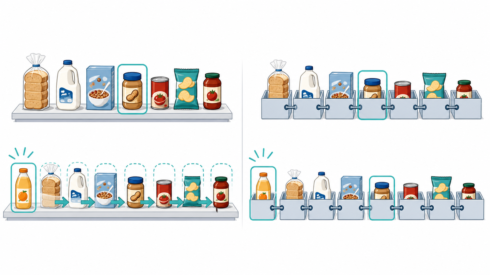

## Recorrido de la sesión {.center}

::: {.tarjetas}
::: {.clave}
1. Decidir

Relacionamos una tarea con la forma de organizar sus datos.
:::
::: {}
2. Comparar

Observamos cómo cambian el acceso, la inserción y la búsqueda.
:::
::: {}
3. Modelar

Separamos el comportamiento esperado de la forma de implementarlo.
:::
::: {}
4. Estimar

Leemos curvas de crecimiento para anticipar el costo al aumentar n.
:::
:::

::: {.neutro}
La sesión combina casos de estudio, preguntas abiertas y modelos visuales.
:::

## Una misma tarea, costos distintos {.center}

::: {.diagrama}
{height=410px fig-alt="El mismo inventario organizado como un estante contiguo y como una cadena de cajas, con estados de búsqueda e inserción resaltados."}
:::

::: {.neutro}
El mismo inventario cambia de costo según cómo se organiza y qué operación se realiza.
:::

## Caso de estudio: una tienda {.center}

::: {.diagrama}
<svg viewBox="0 0 760 310" xmlns="http://www.w3.org/2000/svg" role="img" aria-label="Comparación entre un estante numerado y una bodega con tres cajas enlazadas en línea" font-family="Segoe UI, Inter, system-ui, sans-serif"><defs><marker id="g02" markerWidth="7" markerHeight="7" refX="6" refY="3.5" orient="auto"><path d="M0,0 L7,3.5 L0,7 z" fill="#8fb3d1"/></marker></defs><rect x="14" y="16" width="350" height="276" rx="16" fill="#f5f7fa" stroke="#cfd8e3"/><rect x="386" y="16" width="360" height="276" rx="16" fill="#f5f7fa" stroke="#cfd8e3"/><text x="189" y="46" text-anchor="middle" font-size="16" font-weight="700" fill="#12324f">Estante numerado</text><text x="566" y="46" text-anchor="middle" font-size="16" font-weight="700" fill="#12324f">Bodega enlazada</text><g fill="#eef4fa" stroke="#c7d6e6"><rect x="44" y="82" width="70" height="72" rx="5"/><rect x="114" y="82" width="70" height="72" rx="5"/><rect x="184" y="82" width="70" height="72" rx="5"/><rect x="254" y="82" width="70" height="72" rx="5"/></g><rect x="184" y="82" width="70" height="72" rx="5" fill="#e4f2f1" stroke="#8fc9c5"/><g text-anchor="middle"><g font-size="11" fill="#5b6876"><text x="79" y="102">10</text><text x="149" y="102">11</text><text x="219" y="102">12</text><text x="289" y="102">13</text></g><g font-size="13" font-weight="600" fill="#12324f"><text x="79" y="133">Pasta</text><text x="149" y="133">Café</text><text x="219" y="133">Arroz</text><text x="289" y="133">Aceite</text></g></g><path d="M219,158 L219,184" stroke="#8fb3d1" stroke-width="2.5" marker-end="url(#g02)"/><rect x="88" y="194" width="262" height="58" rx="10" fill="#e4f2f1" stroke="#8fc9c5"/><text x="219" y="218" text-anchor="middle" font-size="13" font-weight="700" fill="#0e6f6c">Buscar la casilla 12</text><text x="219" y="239" text-anchor="middle" font-size="12" fill="#5b6876">calcular la posición y llegar</text><g fill="#eef4fa" stroke="#c7d6e6"><rect x="416" y="130" width="88" height="58" rx="7"/><rect x="526" y="130" width="88" height="58" rx="7"/></g><rect x="636" y="130" width="88" height="58" rx="7" fill="#e4f2f1" stroke="#8fc9c5"/><g text-anchor="middle" font-size="13" font-weight="600"><text x="460" y="164" fill="#12324f">Caja A</text><text x="570" y="164" fill="#12324f">Caja B</text><text x="680" y="164" fill="#0e6f6c">Arroz</text></g><g fill="none" stroke="#8fb3d1" stroke-width="2.5" marker-end="url(#g02)"><path d="M504,159 L520,159"/><path d="M614,159 L630,159"/></g><rect x="430" y="218" width="274" height="44" rx="10" fill="#eef4fa" stroke="#c7d6e6"/><text x="567" y="245" text-anchor="middle" font-size="12" fill="#5b6876">abrir cada caja y seguir la referencia</text></svg>
:::

La tienda atiende unos 200 clientes al día y recibe pocos productos nuevos cada quince días.

## Dos formas de trabajar {.center}

::: {.diagrama}
<svg viewBox="0 0 760 350" xmlns="http://www.w3.org/2000/svg" role="img" aria-label="Cuatro estados comparan el acceso y la inserción en un arreglo y en una lista enlazada" font-family="Segoe UI, Inter, system-ui, sans-serif"><defs><marker id="g03" markerWidth="7" markerHeight="7" refX="6" refY="3.5" orient="auto"><path d="M0,0 L7,3.5 L0,7 z" fill="#8fb3d1"/></marker></defs><g fill="#f5f7fa" stroke="#cfd8e3"><rect x="10" y="10" width="360" height="158" rx="14"/><rect x="390" y="10" width="360" height="158" rx="14"/><rect x="10" y="182" width="360" height="158" rx="14"/><rect x="390" y="182" width="360" height="158" rx="14"/></g><g font-size="14" font-weight="700" fill="#12324f"><text x="28" y="36">1. Arreglo: salto directo</text><text x="408" y="36">2. Lista: recorrido nodo a nodo</text><text x="28" y="208">3. Arreglo: insertar al comienzo</text><text x="408" y="208">4. Lista: insertar al comienzo</text></g><g fill="#eef4fa" stroke="#c7d6e6"><rect x="78" y="72" width="52" height="42"/><rect x="130" y="72" width="52" height="42"/><rect x="182" y="72" width="52" height="42"/><rect x="234" y="72" width="52" height="42"/></g><rect x="182" y="72" width="52" height="42" fill="#e4f2f1" stroke="#8fc9c5"/><path d="M208,48 L208,66" stroke="#8fb3d1" stroke-width="2.5" marker-end="url(#g03)"/><text x="208" y="132" text-anchor="middle" font-size="12" fill="#0e6f6c">posición 2</text><g fill="#eef4fa" stroke="#c7d6e6"><rect x="420" y="72" width="70" height="42" rx="6"/><rect x="520" y="72" width="70" height="42" rx="6"/><rect x="620" y="72" width="70" height="42" rx="6"/></g><g fill="none" stroke="#8fb3d1" stroke-width="2.5" marker-end="url(#g03)"><path d="M490,93 L514,93"/><path d="M590,93 L614,93"/></g><g text-anchor="middle" font-size="12" fill="#12324f"><text x="455" y="98">A</text><text x="555" y="98">B</text><text x="655" y="98">C</text></g><text x="555" y="137" text-anchor="middle" font-size="11" fill="#5b6876">se visita cada referencia</text><g fill="#eef4fa" stroke="#c7d6e6"><rect x="44" y="224" width="54" height="34"/><rect x="98" y="224" width="54" height="34"/><rect x="152" y="224" width="54" height="34"/><rect x="206" y="224" width="54" height="34"/><rect x="44" y="294" width="54" height="34" fill="#e4f2f1" stroke="#8fc9c5"/><rect x="98" y="294" width="54" height="34"/><rect x="152" y="294" width="54" height="34"/><rect x="206" y="294" width="54" height="34"/></g><g text-anchor="middle" font-size="12" font-weight="600"><text x="71" y="246" fill="#12324f">A</text><text x="125" y="246" fill="#12324f">B</text><text x="179" y="246" fill="#12324f">C</text><text x="233" y="246" fill="#5b6876">libre</text><text x="71" y="316" fill="#0e6f6c">N</text><text x="125" y="316" fill="#12324f">A</text><text x="179" y="316" fill="#12324f">B</text><text x="233" y="316" fill="#12324f">C</text></g><g fill="none" stroke="#8fb3d1" stroke-width="2" marker-end="url(#g03)"><path d="M71,260 L119,289"/><path d="M125,260 L173,289"/><path d="M179,260 L227,289"/></g><text x="286" y="279" font-size="11" fill="#5b6876">cada dato cambia</text><text x="286" y="294" font-size="11" fill="#5b6876">de posición</text><g fill="#eef4fa" stroke="#c7d6e6"><rect x="422" y="224" width="62" height="34" rx="5"/><rect x="520" y="224" width="62" height="34" rx="5"/><rect x="422" y="294" width="62" height="34" rx="5" fill="#e4f2f1" stroke="#8fc9c5"/><rect x="520" y="294" width="62" height="34" rx="5"/><rect x="618" y="294" width="62" height="34" rx="5"/></g><g fill="none" stroke="#8fb3d1" stroke-width="2.5" marker-end="url(#g03)"><path d="M484,241 L514,241"/><path d="M484,311 L514,311"/><path d="M582,311 L612,311"/></g><g text-anchor="middle" font-size="12" font-weight="600"><text x="453" y="246" fill="#12324f">A</text><text x="551" y="246" fill="#12324f">B</text><text x="453" y="316" fill="#0e6f6c">N</text><text x="551" y="316" fill="#12324f">A</text><text x="649" y="316" fill="#12324f">B</text></g><path d="M706,241 L706,288" stroke="#8fb3d1" stroke-width="2.5" marker-end="url(#g03)"/><text x="704" y="271" text-anchor="end" font-size="11" fill="#5b6876">cambiar cabeza</text></svg>
:::

Cada organización favorece unas operaciones y encarece otras.

## Pregunta 1 {.center}

::: {.destacado}
En la tienda se consultan productos cientos de veces al día y solo se agregan dos o tres cada quince días. ¿Qué organización elegiría para el inventario?
:::

::: {.tarjetas}
::: {}
Operación dominante

¿Cuál actividad se repite con mayor frecuencia?
:::
::: {}
Costo aceptable

¿Qué trabajo puede ocurrir pocas veces sin afectar la atención?
:::
::: {}
Dato faltante

¿Qué necesitaría saber antes de decidir con seguridad?
:::
:::

Conversen en grupos y sustenten la elección con las operaciones del caso.

## Algoritmo como transformación {.center}

::: {.diagrama}
<svg viewBox="0 0 760 280" xmlns="http://www.w3.org/2000/svg" role="img" aria-label="Un algoritmo transforma una entrada en una salida mediante tres pasos precisos y verificables" font-family="Segoe UI, Inter, system-ui, sans-serif"><defs><marker id="g04" markerWidth="7" markerHeight="7" refX="6" refY="3.5" orient="auto"><path d="M0,0 L7,3.5 L0,7 z" fill="#8fb3d1"/></marker></defs><rect x="20" y="90" width="140" height="82" rx="14" fill="#eef4fa" stroke="#c7d6e6"/><rect x="182" y="62" width="396" height="138" rx="18" fill="#e4f2f1" stroke="#8fc9c5"/><rect x="600" y="90" width="140" height="82" rx="14" fill="#eef4fa" stroke="#c7d6e6"/><g fill="none" stroke="#8fb3d1" stroke-width="2.5" marker-end="url(#g04)"><path d="M160,131 L176,131"/><path d="M578,131 L594,131"/></g><text x="90" y="121" text-anchor="middle" font-size="16" font-weight="700" fill="#12324f">Entrada</text><text x="90" y="146" text-anchor="middle" font-size="12" fill="#5b6876">datos y condición</text><text x="670" y="121" text-anchor="middle" font-size="16" font-weight="700" fill="#12324f">Salida</text><text x="670" y="146" text-anchor="middle" font-size="12" fill="#5b6876">resultado esperado</text><text x="380" y="91" text-anchor="middle" font-size="17" font-weight="700" fill="#0e6f6c">Algoritmo</text><g fill="#ffffff" stroke="#8fc9c5"><rect x="220" y="116" width="90" height="48" rx="10"/><rect x="335" y="116" width="90" height="48" rx="10"/><rect x="450" y="116" width="90" height="48" rx="10"/></g><g text-anchor="middle" font-size="13" font-weight="600" fill="#12324f"><text x="265" y="145">Paso 1</text><text x="380" y="145">Paso 2</text><text x="495" y="145">Paso 3</text></g><g fill="none" stroke="#8fb3d1" stroke-width="2" marker-end="url(#g04)"><path d="M310,140 L329,140"/><path d="M425,140 L444,140"/></g><rect x="226" y="224" width="308" height="42" rx="10" fill="#f5f7fa" stroke="#cfd8e3"/><text x="380" y="250" text-anchor="middle" font-size="13" fill="#5b6876">La misma entrada sigue pasos definidos.</text></svg>
:::

Un algoritmo describe una secuencia finita de pasos que transforma datos de entrada en una salida.

## Cinco propiedades {.center}

::: {.diagrama}
<svg viewBox="0 0 760 350" xmlns="http://www.w3.org/2000/svg" role="img" aria-label="Cinco tarjetas muestran entrada, salida, precisión, finitud y efectividad. La finitud indica que termina después de un número finito de pasos" font-family="Segoe UI, Inter, system-ui, sans-serif"><defs><marker id="g05" markerWidth="10" markerHeight="10" refX="8" refY="3.2" orient="auto"><path d="M0,0 L8,3.2 L0,6.4 z" fill="#8fb3d1"/></marker></defs><rect x="284" y="132" width="192" height="82" rx="18" fill="#e4f2f1" stroke="#8fc9c5"/><text x="380" y="166" text-anchor="middle" font-size="17" font-weight="700" fill="#0e6f6c">Algoritmo</text><text x="380" y="190" text-anchor="middle" font-size="12" fill="#5b6876">transformación verificable</text><g fill="#f5f7fa" stroke="#cfd8e3"><rect x="22" y="28" width="190" height="76" rx="12"/><rect x="548" y="28" width="190" height="76" rx="12"/><rect x="22" y="246" width="190" height="76" rx="12"/><rect x="548" y="246" width="190" height="76" rx="12"/><rect x="285" y="258" width="190" height="76" rx="12"/></g><g fill="none" stroke="#8fb3d1" stroke-width="2" marker-end="url(#g05)"><path d="M212,78 C270,84 300,108 322,128"/><path d="M548,78 C490,84 460,108 438,128"/><path d="M212,270 C270,250 300,226 322,218"/><path d="M548,270 C490,250 460,226 438,218"/><path d="M380,258 L380,220"/></g><g text-anchor="middle"><g font-size="15" font-weight="700" fill="#12324f"><text x="117" y="56">Entrada</text><text x="643" y="56">Salida</text><text x="117" y="274">Precisión</text><text x="643" y="274">Finitud</text><text x="380" y="286">Efectividad</text></g><g font-size="11" fill="#5b6876"><text x="117" y="77">cero o más datos</text><text x="117" y="92">conocidos</text><text x="643" y="77">uno o más resultados</text><text x="643" y="92">definidos</text><text x="117" y="295">cada paso tiene</text><text x="117" y="310">una interpretación</text><text x="643" y="292">termina después de un</text><text x="643" y="308">número finito de pasos</text><text x="380" y="307">cada paso puede</text><text x="380" y="322">realizarse</text></g></g></svg>
:::

Si un paso admite interpretaciones distintas o el proceso puede continuar para siempre, la descripción está incompleta.

## Arreglo contiguo y nodos enlazados {.center}

::: {.diagrama}
<svg viewBox="0 0 760 310" xmlns="http://www.w3.org/2000/svg" role="img" aria-label="Un arreglo aparece como casillas contiguas y una lista como nodos alineados con compartimentos para dato y siguiente referencia" font-family="Segoe UI, Inter, system-ui, sans-serif"><defs><marker id="g06" markerWidth="7" markerHeight="7" refX="6" refY="3.5" orient="auto"><path d="M0,0 L7,3.5 L0,7 z" fill="#8fb3d1"/></marker></defs><rect x="14" y="16" width="732" height="126" rx="14" fill="#f5f7fa" stroke="#cfd8e3"/><rect x="14" y="164" width="732" height="130" rx="14" fill="#f5f7fa" stroke="#cfd8e3"/><text x="36" y="45" font-size="16" font-weight="700" fill="#12324f">Arreglo</text><text x="36" y="66" font-size="12" fill="#5b6876">casillas consecutivas en memoria</text><g fill="#eef4fa" stroke="#c7d6e6"><rect x="190" y="46" width="78" height="58"/><rect x="268" y="46" width="78" height="58"/><rect x="346" y="46" width="78" height="58"/><rect x="424" y="46" width="78" height="58"/><rect x="502" y="46" width="78" height="58"/></g><g text-anchor="middle"><g font-size="14" font-weight="600" fill="#12324f"><text x="229" y="80">18</text><text x="307" y="80">4</text><text x="385" y="80">27</text><text x="463" y="80">9</text><text x="541" y="80">31</text></g><g font-size="11" fill="#5b6876"><text x="229" y="121">0</text><text x="307" y="121">1</text><text x="385" y="121">2</text><text x="463" y="121">3</text><text x="541" y="121">4</text></g></g><text x="36" y="193" font-size="16" font-weight="700" fill="#12324f">Lista enlazada</text><text x="36" y="214" font-size="12" fill="#5b6876">cada nodo guarda un dato y la referencia al siguiente</text><g fill="#eef4fa" stroke="#c7d6e6"><rect x="185" y="226" width="96" height="52" rx="7"/><rect x="320" y="226" width="96" height="52" rx="7"/><rect x="455" y="226" width="96" height="52" rx="7"/><rect x="590" y="226" width="96" height="52" rx="7"/></g><g stroke="#c7d6e6"><path d="M247,226 L247,278"/><path d="M382,226 L382,278"/><path d="M517,226 L517,278"/><path d="M652,226 L652,278"/></g><g fill="none" stroke="#8fb3d1" stroke-width="2.5" marker-end="url(#g06)"><path d="M281,252 L314,252"/><path d="M416,252 L449,252"/><path d="M551,252 L584,252"/></g><g text-anchor="middle"><g font-size="14" font-weight="600" fill="#12324f"><text x="216" y="257">18</text><text x="351" y="257">4</text><text x="486" y="257">27</text><text x="621" y="257">9</text></g><g font-size="11" fill="#5b6876"><text x="264" y="257">sig</text><text x="399" y="257">sig</text><text x="534" y="257">sig</text><text x="669" y="257">fin</text></g></g></svg>
:::

El arreglo calcula posiciones. La lista conoce el siguiente nodo a partir del actual.

## Acceso directo y acceso secuencial {.center}

::: {.diagrama}
<svg viewBox="0 0 760 300" xmlns="http://www.w3.org/2000/svg" role="img" aria-label="El acceso directo salta a una casilla del arreglo mientras el acceso secuencial visita en orden los nodos de una lista" font-family="Segoe UI, Inter, system-ui, sans-serif"><defs><marker id="g07" markerWidth="7" markerHeight="7" refX="6" refY="3.5" orient="auto"><path d="M0,0 L7,3.5 L0,7 z" fill="#8fb3d1"/></marker></defs><rect x="16" y="14" width="728" height="126" rx="14" fill="#f5f7fa" stroke="#cfd8e3"/><rect x="16" y="158" width="728" height="128" rx="14" fill="#f5f7fa" stroke="#cfd8e3"/><text x="36" y="42" font-size="15" font-weight="700" fill="#12324f">Acceso directo en arreglo</text><text x="118" y="84" text-anchor="middle" font-size="12" fill="#0e6f6c">base + índice</text><g fill="#eef4fa" stroke="#c7d6e6"><rect x="250" y="72" width="64" height="50"/><rect x="314" y="72" width="64" height="50"/><rect x="378" y="72" width="64" height="50"/><rect x="442" y="72" width="64" height="50"/><rect x="506" y="72" width="64" height="50"/></g><rect x="442" y="72" width="64" height="50" fill="#e4f2f1" stroke="#8fc9c5"/><path d="M174,94 C250,42 390,42 472,65" fill="none" stroke="#8fb3d1" stroke-width="2.5" marker-end="url(#g07)"/><text x="474" y="103" text-anchor="middle" font-size="14" font-weight="700" fill="#12324f">dato</text><text x="36" y="186" font-size="15" font-weight="700" fill="#12324f">Acceso secuencial en lista</text><g fill="#eef4fa" stroke="#c7d6e6"><rect x="224" y="224" width="82" height="48" rx="6"/><rect x="342" y="224" width="82" height="48" rx="6"/><rect x="460" y="224" width="82" height="48" rx="6"/><rect x="578" y="224" width="82" height="48" rx="6"/></g><rect x="578" y="224" width="82" height="48" rx="6" fill="#e4f2f1" stroke="#8fc9c5"/><g fill="none" stroke="#8fb3d1" stroke-width="2.5" marker-end="url(#g07)"><path d="M306,248 L336,248"/><path d="M424,248 L454,248"/><path d="M542,248 L572,248"/></g><g text-anchor="middle"><g font-size="11" fill="#5b6876"><text x="265" y="216">visita 1</text><text x="383" y="216">visita 2</text><text x="501" y="216">visita 3</text><text x="619" y="216">visita 4</text></g><g font-size="13" font-weight="600" fill="#12324f"><text x="265" y="254">18</text><text x="383" y="254">4</text><text x="501" y="254">27</text><text x="619" y="254">dato</text></g></g><text x="118" y="252" text-anchor="middle" font-size="12" fill="#0e6f6c">desde la cabeza</text></svg>
:::

Llegar a la posición i del arreglo cuesta O(1). En una lista cuesta O(i); en el peor caso, O(n).

## Inserción al comienzo {.center}

::: {.diagrama}
<svg viewBox="0 0 760 320" xmlns="http://www.w3.org/2000/svg" role="img" aria-label="Insertar al comienzo desplaza los elementos de un arreglo y solo actualiza referencias en una lista enlazada" font-family="Segoe UI, Inter, system-ui, sans-serif"><defs><marker id="g08" markerWidth="10" markerHeight="10" refX="8" refY="3.2" orient="auto"><path d="M0,0 L8,3.2 L0,6.4 z" fill="#8fb3d1"/></marker></defs><rect x="14" y="18" width="354" height="286" rx="14" fill="#f5f7fa" stroke="#cfd8e3"/><rect x="392" y="18" width="354" height="286" rx="14" fill="#f5f7fa" stroke="#cfd8e3"/><text x="191" y="48" text-anchor="middle" font-size="16" font-weight="700" fill="#12324f">Arreglo</text><text x="569" y="48" text-anchor="middle" font-size="16" font-weight="700" fill="#12324f">Lista enlazada</text><text x="40" y="82" font-size="11" fill="#5b6876">antes</text><g fill="#eef4fa" stroke="#c7d6e6"><rect x="88" y="62" width="54" height="44"/><rect x="142" y="62" width="54" height="44"/><rect x="196" y="62" width="54" height="44"/><rect x="250" y="62" width="54" height="44"/></g><g text-anchor="middle" font-size="13" fill="#12324f"><text x="115" y="90">A</text><text x="169" y="90">B</text><text x="223" y="90">C</text><text x="277" y="90">D</text></g><g fill="none" stroke="#8fb3d1" stroke-width="2" marker-end="url(#g08)"><path d="M115,130 L142,130"/><path d="M169,148 L196,148"/><path d="M223,166 L250,166"/><path d="M277,184 L304,184"/></g><text x="54" y="226" text-anchor="end" font-size="11" fill="#5b6876">después</text><g fill="#eef4fa" stroke="#c7d6e6"><rect x="61" y="210" width="54" height="44"/><rect x="115" y="210" width="54" height="44"/><rect x="169" y="210" width="54" height="44"/><rect x="223" y="210" width="54" height="44"/><rect x="277" y="210" width="54" height="44"/></g><rect x="61" y="210" width="54" height="44" fill="#e4f2f1" stroke="#8fc9c5"/><g text-anchor="middle" font-size="13" fill="#12324f"><text x="88" y="238">N</text><text x="142" y="238">A</text><text x="196" y="238">B</text><text x="250" y="238">C</text><text x="304" y="238">D</text></g><text x="191" y="282" text-anchor="middle" font-size="12" fill="#5b6876">se desplazan n elementos: O(n)</text><g fill="#eef4fa" stroke="#c7d6e6"><rect x="478" y="76" width="88" height="48" rx="6"/><rect x="620" y="76" width="88" height="48" rx="6"/></g><path d="M566,100 L614,100" stroke="#8fb3d1" stroke-width="2" marker-end="url(#g08)"/><text x="522" y="106" text-anchor="middle" font-size="13" fill="#12324f">A</text><text x="664" y="106" text-anchor="middle" font-size="13" fill="#12324f">B</text><rect x="428" y="204" width="88" height="48" rx="6" fill="#e4f2f1" stroke="#8fc9c5"/><rect x="570" y="204" width="88" height="48" rx="6" fill="#eef4fa" stroke="#c7d6e6"/><path d="M516,228 L564,228" stroke="#8fb3d1" stroke-width="2" marker-end="url(#g08)"/><text x="472" y="234" text-anchor="middle" font-size="13" font-weight="700" fill="#0e6f6c">N</text><text x="614" y="234" text-anchor="middle" font-size="13" fill="#12324f">A</text><path d="M472,198 C478,162 520,154 560,198" fill="none" stroke="#8fb3d1" stroke-width="2" marker-end="url(#g08)"/><text x="569" y="282" text-anchor="middle" font-size="12" fill="#5b6876">se actualizan referencias: O(1)</text></svg>
:::

La diferencia aparece porque el arreglo conserva la continuidad y la lista conserva enlaces.

## Pregunta 2 {.center}

Un arreglo y una lista enlazada guardan un millón de elementos con los mismos valores. Predigan el costo relativo.

| Operación | Arreglo | Lista enlazada |
|---|:---:|:---:|
| Leer la posición 500.000 | ¿Barato o costoso? | ¿Barato o costoso? |
| Agregar al final | ¿Barato o costoso? | ¿Barato o costoso? |
| Insertar en la posición 0 | ¿Barato o costoso? | ¿Barato o costoso? |
| Borrar el primer elemento | ¿Barato o costoso? | ¿Barato o costoso? |
| Recorrer todos los elementos | ¿Barato o costoso? | ¿Barato o costoso? |
| Buscar un valor sin conocer su posición | ¿Barato o costoso? | ¿Barato o costoso? |

::: {.neutro}
Anoten una condición que pueda cambiar alguna respuesta.
:::

## Costos y condiciones {.center}

| Operación | Arreglo | Lista enlazada |
|---|---|---|
| Leer la posición 500.000 | O(1). Calcula la dirección | O(n). Recorre enlaces |
| Agregar al final | O(1) amortizado en un arreglo dinámico | O(1) solo si conserva una referencia al último nodo; sin ella, O(n) |
| Insertar en la posición 0 | O(n). Desplaza elementos | O(1). Cambia la cabeza |
| Borrar el primer elemento | O(n). Desplaza elementos | O(1). Cambia la cabeza |
| Recorrer todos los elementos | O(n) | O(n) |
| Buscar un valor sin conocer su posición | O(n) | O(n) |

::: {.destacado}
La complejidad resume cómo crece el trabajo. Las condiciones de implementación explican cuándo aplica ese costo.
:::

## Un millón frente a veinte {.center}

::: {.diagrama}
<svg viewBox="0 0 760 300" xmlns="http://www.w3.org/2000/svg" role="img" aria-label="Comparación visual entre hasta un millón de comparaciones secuenciales y cerca de veinte decisiones binarias" font-family="Segoe UI, Inter, system-ui, sans-serif"><rect x="16" y="18" width="728" height="264" rx="16" fill="#f5f7fa" stroke="#cfd8e3"/><text x="40" y="52" font-size="16" font-weight="700" fill="#12324f">Buscar un valor entre 1.000.000 de elementos</text><text x="40" y="92" font-size="14" font-weight="700" fill="#12324f">Búsqueda secuencial</text><rect x="210" y="72" width="500" height="34" rx="8" fill="#eef4fa" stroke="#c7d6e6"/><g fill="#8fb3d1"><rect x="214" y="78" width="18" height="22"/><rect x="236" y="78" width="18" height="22"/><rect x="258" y="78" width="18" height="22"/><rect x="280" y="78" width="18" height="22"/><rect x="302" y="78" width="18" height="22"/><rect x="324" y="78" width="18" height="22"/><rect x="346" y="78" width="18" height="22"/><rect x="368" y="78" width="18" height="22"/><rect x="390" y="78" width="18" height="22"/><rect x="412" y="78" width="18" height="22"/><rect x="434" y="78" width="18" height="22"/><rect x="456" y="78" width="18" height="22"/><rect x="478" y="78" width="18" height="22"/><rect x="500" y="78" width="18" height="22"/><rect x="522" y="78" width="18" height="22"/><rect x="544" y="78" width="18" height="22"/><rect x="566" y="78" width="18" height="22"/><rect x="588" y="78" width="18" height="22"/><rect x="610" y="78" width="18" height="22"/><rect x="632" y="78" width="18" height="22"/><rect x="654" y="78" width="18" height="22"/><rect x="676" y="78" width="18" height="22"/></g><text x="460" y="128" text-anchor="middle" font-size="12" fill="#5b6876">puede revisar los 1.000.000 uno por uno</text><text x="40" y="184" font-size="14" font-weight="700" fill="#12324f">Búsqueda binaria</text><g fill="#e4f2f1" stroke="#8fc9c5"><circle cx="230" cy="178" r="17"/><circle cx="270" cy="178" r="17"/><circle cx="310" cy="178" r="17"/><circle cx="350" cy="178" r="17"/><circle cx="390" cy="178" r="17"/><circle cx="430" cy="178" r="17"/><circle cx="470" cy="178" r="17"/><circle cx="510" cy="178" r="17"/><circle cx="550" cy="178" r="17"/><circle cx="590" cy="178" r="17"/></g><text x="610" y="184" font-size="12" fill="#0e6f6c">aproximadamente 20</text><text x="460" y="224" text-anchor="middle" font-size="12" fill="#5b6876">cada decisión descarta la mitad del intervalo restante</text><rect x="184" y="244" width="552" height="26" rx="8" fill="#e4f2f1" stroke="#8fc9c5"/><text x="460" y="262" text-anchor="middle" font-size="12" font-weight="600" fill="#0e6f6c">La búsqueda binaria requiere datos ordenados.</text></svg>
:::

La comparación cuenta decisiones en el peor caso; no representa una medición de tiempo.

## Búsqueda binaria por estados {.center}

::: {.diagrama}
<svg viewBox="0 0 760 360" xmlns="http://www.w3.org/2000/svg" role="img" aria-label="Dos estados de una búsqueda binaria reducen un arreglo ordenado hasta encontrar el valor 31" font-family="Segoe UI, Inter, system-ui, sans-serif"><defs><marker id="g09" markerWidth="10" markerHeight="10" refX="8" refY="3.2" orient="auto"><path d="M0,0 L8,3.2 L0,6.4 z" fill="#8fb3d1"/></marker></defs><text x="18" y="24" font-size="13" font-weight="700" fill="#12324f">Objetivo: 31. Datos ordenados.</text><g fill="#eef4fa" stroke="#c7d6e6"><rect x="82" y="48" width="68" height="42"/><rect x="150" y="48" width="68" height="42"/><rect x="218" y="48" width="68" height="42"/><rect x="286" y="48" width="68" height="42"/><rect x="354" y="48" width="68" height="42"/><rect x="422" y="48" width="68" height="42"/><rect x="490" y="48" width="68" height="42"/><rect x="558" y="48" width="68" height="42"/></g><rect x="286" y="48" width="68" height="42" fill="#e4f2f1" stroke="#8fc9c5"/><g text-anchor="middle" font-size="13" fill="#12324f"><text x="116" y="75">4</text><text x="184" y="75">9</text><text x="252" y="75">12</text><text x="320" y="75">18</text><text x="388" y="75">23</text><text x="456" y="75">31</text><text x="524" y="75">44</text><text x="592" y="75">57</text></g><text x="650" y="75" font-size="11" fill="#5b6876">31 es mayor</text><path d="M380,96 L380,122" stroke="#8fb3d1" stroke-width="2" marker-end="url(#g09)"/><g opacity="0.32" fill="#eef4fa" stroke="#c7d6e6"><rect x="82" y="132" width="68" height="42"/><rect x="150" y="132" width="68" height="42"/><rect x="218" y="132" width="68" height="42"/><rect x="286" y="132" width="68" height="42"/></g><g fill="#eef4fa" stroke="#c7d6e6"><rect x="354" y="132" width="68" height="42"/><rect x="422" y="132" width="68" height="42"/><rect x="490" y="132" width="68" height="42"/><rect x="558" y="132" width="68" height="42"/></g><rect x="422" y="132" width="68" height="42" fill="#e4f2f1" stroke="#8fc9c5"/><g text-anchor="middle" font-size="13" fill="#12324f"><text x="116" y="159">4</text><text x="184" y="159">9</text><text x="252" y="159">12</text><text x="320" y="159">18</text><text x="388" y="159">23</text><text x="456" y="159">31</text><text x="524" y="159">44</text><text x="592" y="159">57</text></g><text x="650" y="159" font-size="11" fill="#0e6f6c">encontrado</text><path d="M456,180 L456,206" stroke="#8fb3d1" stroke-width="2" marker-end="url(#g09)"/><rect x="270" y="216" width="372" height="56" rx="12" fill="#e4f2f1" stroke="#8fc9c5"/><text x="456" y="240" text-anchor="middle" font-size="14" font-weight="700" fill="#0e6f6c">Dos comparaciones en este caso</text><text x="456" y="260" text-anchor="middle" font-size="11" fill="#5b6876">cada estado conserva solo el intervalo posible</text><rect x="112" y="300" width="536" height="42" rx="10" fill="#f5f7fa" stroke="#cfd8e3"/><text x="380" y="326" text-anchor="middle" font-size="12" fill="#12324f">Sin orden, descartar una mitad podría eliminar la respuesta.</text></svg>
:::

El algoritmo compara con el valor central y conserva la mitad donde todavía puede estar el objetivo.

## Contrato e implementación {.center}

::: {.diagrama}
<svg viewBox="0 0 760 320" xmlns="http://www.w3.org/2000/svg" role="img" aria-label="Un contrato de pila define operaciones y dos implementaciones distintas, arreglo dinámico y lista enlazada, cumplen el mismo comportamiento" font-family="Segoe UI, Inter, system-ui, sans-serif"><defs><marker id="g10" markerWidth="10" markerHeight="10" refX="8" refY="3.2" orient="auto"><path d="M0,0 L8,3.2 L0,6.4 z" fill="#8fb3d1"/></marker></defs><rect x="220" y="18" width="320" height="112" rx="16" fill="#e4f2f1" stroke="#8fc9c5"/><text x="380" y="48" text-anchor="middle" font-size="17" font-weight="700" fill="#0e6f6c">Contrato: pila</text><text x="380" y="75" text-anchor="middle" font-size="13" fill="#12324f">apilar, desapilar, consultar cima</text><text x="380" y="98" text-anchor="middle" font-size="12" fill="#5b6876">el último elemento agregado sale primero</text><path d="M380,130 L380,160" stroke="#8fb3d1" stroke-width="3"/><path d="M380,160 L210,196" stroke="#8fb3d1" stroke-width="2" marker-end="url(#g10)"/><path d="M380,160 L550,196" stroke="#8fb3d1" stroke-width="2" marker-end="url(#g10)"/><rect x="54" y="202" width="312" height="100" rx="14" fill="#eef4fa" stroke="#c7d6e6"/><rect x="394" y="202" width="312" height="100" rx="14" fill="#eef4fa" stroke="#c7d6e6"/><text x="210" y="232" text-anchor="middle" font-size="15" font-weight="700" fill="#12324f">Arreglo dinámico</text><text x="210" y="256" text-anchor="middle" font-size="12" fill="#5b6876">la cima ocupa el final del arreglo</text><text x="210" y="280" text-anchor="middle" font-size="12" fill="#0e6f6c">cumple el mismo contrato</text><text x="550" y="232" text-anchor="middle" font-size="15" font-weight="700" fill="#12324f">Lista enlazada</text><text x="550" y="256" text-anchor="middle" font-size="12" fill="#5b6876">la cima ocupa la cabeza de la lista</text><text x="550" y="280" text-anchor="middle" font-size="12" fill="#0e6f6c">cumple el mismo contrato</text></svg>
:::

El tipo de dato abstracto define el comportamiento. La estructura de datos decide cómo guardarlo en memoria.

## Pila: último en entrar, primero en salir {.center}

::: {.diagrama}
<svg viewBox="0 0 760 330" xmlns="http://www.w3.org/2000/svg" role="img" aria-label="Dos estados de una pila muestran los documentos A y B antes de apilar C, los tres documentos después, y C separado como salida al desapilar" font-family="Segoe UI, Inter, system-ui, sans-serif"><defs><marker id="g11" markerWidth="7" markerHeight="7" refX="6" refY="3.5" orient="auto"><path d="M0,0 L7,3.5 L0,7 z" fill="#8fb3d1"/></marker></defs><text x="160" y="34" text-anchor="middle" font-size="15" font-weight="700" fill="#12324f">Antes de apilar C</text><text x="390" y="34" text-anchor="middle" font-size="15" font-weight="700" fill="#12324f">Después de apilar C</text><text x="650" y="34" text-anchor="middle" font-size="15" font-weight="700" fill="#12324f">Salida</text><path d="M78,82 L78,292 L242,292 L242,82" fill="none" stroke="#12324f" stroke-width="3"/><g fill="#eef4fa" stroke="#c7d6e6"><rect x="92" y="230" width="136" height="48" rx="7"/><rect x="92" y="174" width="136" height="48" rx="7"/></g><g text-anchor="middle" font-size="13" font-weight="600" fill="#12324f"><text x="160" y="259">Documento A</text><text x="160" y="203">Documento B</text></g><path d="M308,82 L308,292 L472,292 L472,82" fill="none" stroke="#12324f" stroke-width="3"/><g fill="#eef4fa" stroke="#c7d6e6"><rect x="322" y="230" width="136" height="48" rx="7"/><rect x="322" y="174" width="136" height="48" rx="7"/></g><rect x="322" y="118" width="136" height="48" rx="7" fill="#e4f2f1" stroke="#8fc9c5"/><g text-anchor="middle" font-size="13" font-weight="600"><text x="390" y="259" fill="#12324f">Documento A</text><text x="390" y="203" fill="#12324f">Documento B</text><text x="390" y="147" fill="#0e6f6c">Documento C</text></g><path d="M252,142 L298,142" fill="none" stroke="#8fb3d1" stroke-width="2.5" marker-end="url(#g11)"/><text x="275" y="128" text-anchor="middle" font-size="12" font-weight="700" fill="#0e6f6c">apilar C</text><rect x="586" y="68" width="128" height="54" rx="8" fill="#e4f2f1" stroke="#8fc9c5"/><text x="650" y="101" text-anchor="middle" font-size="13" font-weight="600" fill="#0e6f6c">Documento C</text><path d="M478,142 C518,142 528,95 578,95" fill="none" stroke="#8fb3d1" stroke-width="2.5" marker-end="url(#g11)"/><text x="526" y="130" text-anchor="middle" font-size="12" font-weight="700" fill="#0e6f6c">desapilar</text><text x="390" y="318" text-anchor="middle" font-size="12" fill="#5b6876">La entrada y la salida usan la cima.</text></svg>
:::

Un arreglo dinámico puede implementar la pila si agrega y retira por el final. Una lista también puede hacerlo desde su cabeza.

## Cola: primero en entrar, primero en salir {.center}

::: {.diagrama}
<svg viewBox="0 0 760 330" xmlns="http://www.w3.org/2000/svg" role="img" aria-label="Una cola circular muestra al cliente A saliendo por el frente, al cliente D entrando en una casilla libre y el retorno al inicio al llegar al final" font-family="Segoe UI, Inter, system-ui, sans-serif"><defs><marker id="g12" markerWidth="7" markerHeight="7" refX="6" refY="3.5" orient="auto"><path d="M0,0 L7,3.5 L0,7 z" fill="#8fb3d1"/></marker></defs><rect x="18" y="16" width="724" height="296" rx="18" fill="#f5f7fa" stroke="#cfd8e3"/><text x="380" y="46" text-anchor="middle" font-size="16" font-weight="700" fill="#12324f">Arreglo circular</text><g fill="#eef4fa" stroke="#c7d6e6"><rect x="120" y="130" width="86" height="62" rx="8"/><rect x="206" y="130" width="86" height="62" rx="8"/><rect x="292" y="130" width="86" height="62" rx="8"/><rect x="378" y="130" width="86" height="62" rx="8"/><rect x="464" y="130" width="86" height="62" rx="8"/><rect x="550" y="130" width="86" height="62" rx="8"/></g><g fill="#e4f2f1" stroke="#8fc9c5"><rect x="120" y="130" width="86" height="62" rx="8"/><rect x="206" y="130" width="86" height="62" rx="8"/><rect x="292" y="130" width="86" height="62" rx="8"/></g><g text-anchor="middle" font-size="12" font-weight="600" fill="#12324f"><text x="163" y="166">Cliente A</text><text x="249" y="166">Cliente B</text><text x="335" y="166">Cliente C</text><text x="421" y="166">libre</text><text x="507" y="166">libre</text><text x="593" y="166">libre</text></g><path d="M112,161 L58,161" stroke="#8fb3d1" stroke-width="2.5" marker-end="url(#g12)"/><text x="84" y="145" text-anchor="middle" font-size="12" font-weight="700" fill="#0e6f6c">sale A</text><rect x="660" y="80" width="66" height="42" rx="7" fill="#e4f2f1" stroke="#8fc9c5"/><text x="693" y="106" text-anchor="middle" font-size="12" font-weight="600" fill="#0e6f6c">Cliente D</text><path d="M655,112 C600,88 468,92 427,123" fill="none" stroke="#8fb3d1" stroke-width="2.5" marker-end="url(#g12)"/><text x="545" y="88" text-anchor="middle" font-size="12" font-weight="700" fill="#0e6f6c">entra D</text><path d="M593,214 C650,250 650,278 378,278 C138,278 92,252 151,213" fill="none" stroke="#aebdca" stroke-width="2" stroke-dasharray="7 7" marker-end="url(#g12)"/><text x="378" y="300" text-anchor="middle" font-size="12" fill="#5b6876">cuando llega al final</text></svg>
:::

Una cola con arreglo circular mueve los índices de frente y final. Así evita desplazar los elementos en cada salida.

## Curvas de crecimiento {.center}

::: {.diagrama}
<svg viewBox="0 0 760 300" xmlns="http://www.w3.org/2000/svg" role="img" aria-label="Curvas de crecimiento comparadas: logaritmo de n, n, n por logaritmo de n y n al cuadrado" font-family="Segoe UI, Inter, system-ui, sans-serif"><g stroke="#cfd8e3" stroke-width="1.5" fill="none"><path d="M76,26 L76,254"/><path d="M76,254 L700,254"/></g><text x="14" y="24" font-size="11.5" fill="#5b6876">operaciones</text><text x="700" y="276" font-size="11.5" fill="#5b6876" text-anchor="end">tamaño de la entrada (n)</text><g fill="none" stroke-width="3"><path d="M76,250 C110,190 170,168 680,158" stroke="#8fc9c5"/><path d="M76,250 L680,120" stroke="#8fb3d1"/><path d="M76,250 C300,206 500,140 680,64" stroke="#0e6f6c"/><path d="M76,250 C420,244 566,190 640,34" stroke="#12324f"/></g><g font-size="12.5" font-weight="600"><text x="690" y="162" fill="#3c7d7a">log n</text><text x="690" y="124" fill="#5b7f9f">n</text><text x="690" y="68" fill="#0e6f6c">n log n</text><text x="650" y="34" fill="#12324f">n al cuadrado</text></g><text x="90" y="292" font-size="11.5" fill="#5b6876">Duplicar los datos suma un paso a la logarítmica y cuadruplica el trabajo de la cuadrática.</text></svg>
:::

Las curvas muestran qué tan rápido aumenta el trabajo cuando crece el tamaño de la entrada.

## Cómo leer las curvas {.center}

| Complejidad | n = 10 | n = 100 | Al duplicar n |
|---|---:|---:|---|
| log n | 3,32 | 6,64 | Suma un paso aproximadamente |
| n | 10 | 100 | Duplica el trabajo |
| n log n | 33,2 | 664,4 | Crece un poco más del doble |
| n al cuadrado | 100 | 10.000 | Cuadruplica el trabajo |

::: {.neutro}
Los valores de log n usan base 2. Expresan crecimiento matemático, no tiempos de una máquina.
:::

## Pregunta 3 {.center}

::: {.diagrama}
<svg viewBox="0 0 760 350" xmlns="http://www.w3.org/2000/svg" role="img" aria-label="Tres problemas ilustrados: historial de deshacer, catálogo de productos y fila de atención, cada uno con una pregunta abierta" font-family="Segoe UI, Inter, system-ui, sans-serif"><rect x="10" y="18" width="236" height="314" rx="16" fill="#f5f7fa" stroke="#cfd8e3"/><rect x="262" y="18" width="236" height="314" rx="16" fill="#f5f7fa" stroke="#cfd8e3"/><rect x="514" y="18" width="236" height="314" rx="16" fill="#f5f7fa" stroke="#cfd8e3"/><text x="128" y="48" text-anchor="middle" font-size="15" font-weight="700" fill="#12324f">Historial de edición</text><g fill="#eef4fa" stroke="#c7d6e6"><rect x="72" y="80" width="112" height="42" rx="6"/><rect x="72" y="128" width="112" height="42" rx="6"/><rect x="72" y="176" width="112" height="42" rx="6"/></g><g text-anchor="middle" font-size="12" fill="#12324f"><text x="128" y="106">acción 1</text><text x="128" y="154">acción 2</text><text x="128" y="202">acción 3</text></g><text x="128" y="248" text-anchor="middle" font-size="12" fill="#0e6f6c">¿Qué extremo usaría</text><text x="128" y="266" text-anchor="middle" font-size="12" fill="#0e6f6c">para agregar y deshacer?</text><text x="380" y="48" text-anchor="middle" font-size="15" font-weight="700" fill="#12324f">Catálogo fijo</text><g fill="#eef4fa" stroke="#c7d6e6"><rect x="300" y="88" width="160" height="120" rx="8"/></g><g fill="#e4f2f1" stroke="#8fc9c5"><rect x="316" y="106" width="36" height="30"/><rect x="356" y="106" width="36" height="30"/><rect x="396" y="106" width="36" height="30"/><rect x="316" y="142" width="36" height="30"/><rect x="356" y="142" width="36" height="30"/><rect x="396" y="142" width="36" height="30"/></g><path d="M436,168 L464,196" stroke="#8fb3d1" stroke-width="4"/><circle cx="470" cy="202" r="16" fill="none" stroke="#8fb3d1" stroke-width="4"/><text x="380" y="248" text-anchor="middle" font-size="12" fill="#0e6f6c">¿Qué organización favorece</text><text x="380" y="266" text-anchor="middle" font-size="12" fill="#0e6f6c">miles de consultas?</text><text x="632" y="48" text-anchor="middle" font-size="15" font-weight="700" fill="#12324f">Atención continua</text><g fill="#eef4fa" stroke="#c7d6e6"><circle cx="566" cy="126" r="24"/><circle cx="632" cy="126" r="24"/><circle cx="698" cy="126" r="24"/></g><g text-anchor="middle" font-size="13" font-weight="600" fill="#12324f"><text x="566" y="132">A</text><text x="632" y="132">B</text><text x="698" y="132">C</text></g><path d="M550,182 L714,182" stroke="#8fb3d1" stroke-width="3"/><text x="550" y="204" font-size="11" fill="#5b6876">sale</text><text x="690" y="204" font-size="11" fill="#5b6876">entra</text><text x="632" y="248" text-anchor="middle" font-size="12" fill="#0e6f6c">¿Cómo evitaría desplazar</text><text x="632" y="266" text-anchor="middle" font-size="12" fill="#0e6f6c">toda la fila?</text><text x="128" y="304" text-anchor="middle" font-size="11" fill="#5b6876">operación dominante</text><text x="380" y="304" text-anchor="middle" font-size="11" fill="#5b6876">acceso frecuente</text><text x="632" y="304" text-anchor="middle" font-size="11" fill="#5b6876">entrada y salida</text></svg>
:::

Discutan qué contrato necesita cada problema y qué implementación elegirían. Comparen también una alternativa razonable.

## Mapa visual del semestre {.center}

::: {.diagrama}
<svg viewBox="0 0 760 300" xmlns="http://www.w3.org/2000/svg" role="img" aria-label="Mapa de cuatro unidades conectadas desde fundamentos y recursividad hasta estructuras fijas, estructuras dinámicas y análisis de algoritmos" font-family="Segoe UI, Inter, system-ui, sans-serif"><defs><marker id="g13" markerWidth="10" markerHeight="10" refX="8" refY="3.2" orient="auto"><path d="M0,0 L8,3.2 L0,6.4 z" fill="#8fb3d1"/></marker></defs><path d="M98,150 L662,150" stroke="#8fb3d1" stroke-width="4"/><g fill="none" stroke="#8fb3d1" stroke-width="2" marker-end="url(#g13)"><path d="M210,150 L246,150"/><path d="M402,150 L438,150"/><path d="M594,150 L630,150"/></g><g fill="#e4f2f1" stroke="#8fc9c5"><circle cx="98" cy="150" r="46"/><circle cx="290" cy="150" r="46"/><circle cx="482" cy="150" r="46"/><circle cx="674" cy="150" r="46"/></g><g text-anchor="middle" font-size="14" font-weight="700" fill="#0e6f6c"><text x="98" y="155">Unidad 1</text><text x="290" y="155">Unidad 2</text><text x="482" y="155">Unidad 3</text><text x="674" y="155">Unidad 4</text></g><g fill="#f5f7fa" stroke="#cfd8e3"><rect x="18" y="24" width="160" height="70" rx="12"/><rect x="210" y="206" width="160" height="70" rx="12"/><rect x="402" y="24" width="160" height="70" rx="12"/><rect x="582" y="206" width="160" height="70" rx="12"/></g><g text-anchor="middle"><g font-size="13" font-weight="700" fill="#12324f"><text x="98" y="49">Fundamentos</text><text x="290" y="231">Estructuras fijas</text><text x="482" y="49">Estructuras dinámicas</text><text x="662" y="231">Costo y búsqueda</text></g><g font-size="11" fill="#5b6876"><text x="98" y="69">algoritmos, objetos</text><text x="98" y="84">y recursividad</text><text x="290" y="251">vectores, matrices,</text><text x="290" y="266">pilas y colas</text><text x="482" y="69">listas, árboles</text><text x="482" y="84">y grafos</text><text x="662" y="251">ordenamiento, caminos</text><text x="662" y="266">y eficiencia</text></g></g><g stroke="#8fb3d1" stroke-width="2" fill="none"><path d="M98,104 L98,94"/><path d="M290,196 L290,206"/><path d="M482,104 L482,94"/><path d="M674,196 L674,206"/></g></svg>
:::

Cada unidad reutiliza decisiones y conceptos de las anteriores. El análisis de costo acompaña todo el recorrido.

## Ideas para continuar {.center}

::: {.tarjetas}
::: {.clave}
La operación guía la elección

Primero identifique qué hace el programa con mayor frecuencia.
:::
::: {}
El contrato separa responsabilidades

Define qué debe ocurrir sin fijar una única organización en memoria.
:::
::: {}
La escala cambia la respuesta

Una solución adecuada para diez datos puede fallar con un millón.
:::
:::

::: {.destacado}
Revisa el material de la sesión antes del Tema 2.
:::
