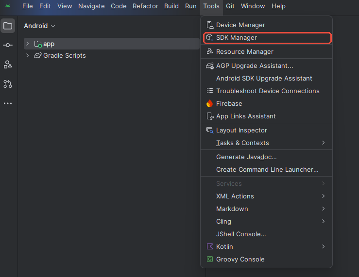
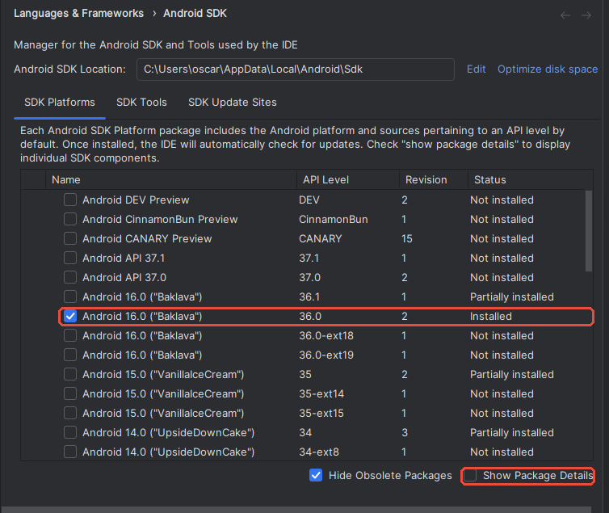
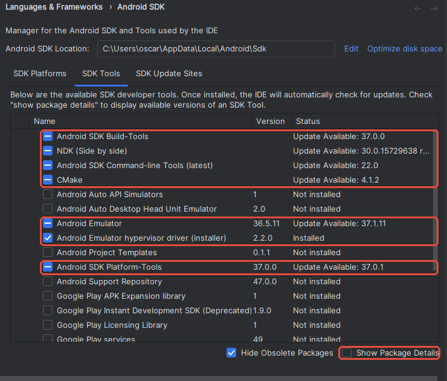
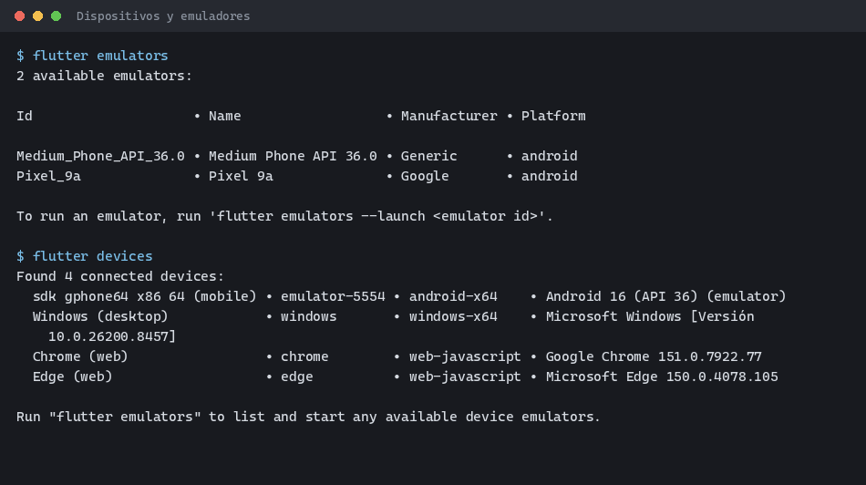
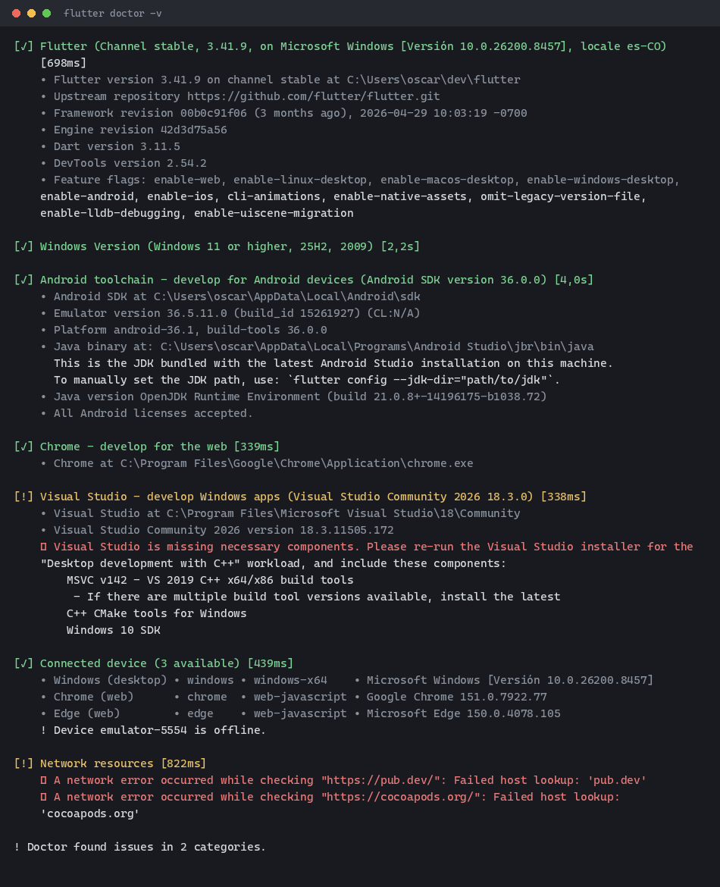
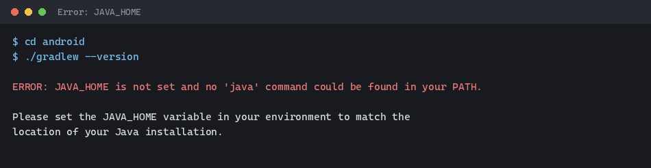

::: {.ficha}
|        |                                                                                          |
|--------|------------------------------------------------------------------------------------------|
| Unidad | Unidad 2. Herramientas de trabajo en desarrollo de aplicaciones para dispositivos móviles |
| Tema   | Tema 1. Instalación del entorno de desarrollo móvil                                      |
:::

## Lo que vas a lograr

Al terminar esta guía tu computador queda con todas las herramientas del semestre instaladas y
verificadas. En el Tema 2 creas tu primer proyecto sobre este entorno.

Objetivos concretos:

1. Instalar Git, el SDK de Flutter, Android Studio y Visual Studio Code.
2. Configurar el `PATH` para que los comandos de Flutter funcionen desde cualquier terminal.
3. Preparar un emulador o un teléfono Android listo para recibir aplicaciones.
4. Diagnosticar la instalación con `flutter doctor` y dejarla sin errores que bloqueen.

::: {.callout-note}
## Antes de instalar nada

Reserva **15 GB libres en disco** y una conexión estable. La descarga completa supera los
6 GB entre el SDK de Flutter, Android Studio y las imágenes del emulador. En la sala de cómputo
usa cable de red si lo tienes disponible.
:::

### Requisitos de la máquina

| Componente        | Mínimo                                  | Recomendado             |
|-------------------|-----------------------------------------|-------------------------|
| Sistema operativo | Windows 10 de 64 bits, macOS 13 o Ubuntu 22.04 | Windows 11 o macOS 14 |
| Memoria RAM       | 8 GB                                    | 16 GB                   |
| Disco libre       | 15 GB                                   | 30 GB en unidad SSD     |
| Procesador        | x86_64 o Apple Silicon con virtualización | 4 núcleos o más       |

Si tu equipo tiene 8 GB de RAM, conecta un teléfono Android por cable en vez de usar el
emulador. Consume mucha menos memoria y responde más rápido.

### Versiones de referencia

Esta guía se probó con estas versiones. Instala la misma línea o una superior.

| Herramienta        | Versión probada |
|--------------------|-----------------|
| Flutter            | 3.41.9 (stable) |
| Dart               | 3.11.5          |
| Android SDK        | 36.0.0          |
| NDK                | 28.2.13676358   |
| JDK                | 21 (OpenJDK)    |
| Git                | 2.50            |
| Visual Studio Code | 1.132           |

::: {.callout-tip}
## Trabajas en Linux o macOS

Cada paso trae las instrucciones para los tres sistemas. Sigue la subsección que corresponde a
tu equipo e ignora las otras dos. El resultado final es el mismo en los tres casos.
:::

## Instalación paso a paso

### [1]{.paso} Git

Descarga desde [git-scm.com/install](https://git-scm.com/install/) y sigue las instrucciones de
tu sistema.

#### Windows

Descarga el instalador de 64 bits y ejecútalo. Acepta las opciones por omisión en todas las
pantallas. La única que conviene revisar es **Adjusting your PATH environment**, donde debe
quedar marcada la opción recomendada: *Git from the command line and also from 3rd-party
software*.

#### macOS

Instala las herramientas de línea de comandos de Apple, que ya traen Git:

```bash
xcode-select --install
```

Si usas Homebrew y prefieres una versión más reciente:

```bash
brew install git
```

#### Linux

```bash
# Ubuntu y derivadas
sudo apt update && sudo apt install -y git

# Fedora
sudo dnf install -y git
```

#### Verifica y configura tu identidad

Abre una terminal nueva y comprueba la instalación:

```bash
git --version
```

Configura tu nombre y correo. Usa el correo institucional, porque con él vas a entregar el
repositorio del proyecto más adelante.

```bash
git config --global user.name "Tu Nombre Completo"
git config --global user.email "tucorreo@correo.iue.edu.co"
```

### [2]{.paso} SDK de Flutter por instalación manual

Vas a descargar el SDK como archivo comprimido, descomprimirlo en una carpeta tuya y registrarlo
en el `PATH`. Este método no depende de instaladores ni de gestores de paquetes, así que
funciona igual en los tres sistemas y te deja el control de dónde queda todo.

Página oficial del método: [docs.flutter.dev/install/manual](https://docs.flutter.dev/install/manual).

#### Paso 2.1: descarga el paquete de tu sistema

Entra al enlace anterior y elige tu sistema operativo. Descarga el paquete del canal **stable**.

| Sistema | Archivo             | Nota                                                    |
|---------|---------------------|---------------------------------------------------------|
| Windows | `.zip`              | Un solo paquete para todos los equipos                  |
| macOS   | `.zip`              | Escoge **Apple Silicon** o **Intel** según tu procesador |
| Linux   | `.tar.xz`           | Un solo paquete de 64 bits                              |

En macOS, si no sabes cuál procesador tienes, abre el menú Apple y entra a **Acerca de este
Mac**. Si dice *Chip Apple M1*, *M2*, *M3* o *M4*, descarga el paquete de Apple Silicon.

#### Paso 2.2: descomprime en una carpeta estable

La carpeta que elijas queda como la ubicación definitiva del SDK. Si la mueves después, tienes
que rehacer el `PATH`.

::: {.callout-important}
## La ruta no puede tener espacios, tildes ni eñes

Evita `Archivos de programa`, `Program Files`, `Escritorio` y `OneDrive`. El compilador falla
con rutas así. Usa una ruta corta y sin acentos.
:::

**Windows.** Descomprime el contenido en `C:\dev\flutter`. Al abrir esa carpeta debes ver
adentro `bin`, `packages` y el archivo `flutter_console.bat`.

**macOS y Linux.** Crea la carpeta y descomprime allí:

```bash
mkdir -p ~/development
cd ~/development

# macOS
unzip ~/Downloads/flutter_macos_arm64_3.41.9-stable.zip

# Linux
tar -xf ~/Downloads/flutter_linux_3.41.9-stable.tar.xz
```

Ajusta el nombre del archivo al que descargaste. El resultado queda en `~/development/flutter`.

#### Paso 2.3: agrega Flutter al PATH

**Windows**

1. Presiona la tecla Windows y escribe `variables de entorno`.
2. Abre **Editar las variables de entorno de esta cuenta**.
3. En el recuadro superior selecciona la variable `Path` y presiona **Editar**.
4. Presiona **Nuevo** y escribe `C:\dev\flutter\bin`.
5. Acepta las tres ventanas con **Aceptar**.
6. Cierra todas las terminales abiertas. Los cambios solo aplican a las que abras después.

**macOS**

Averigua cuál intérprete usa tu terminal:

```bash
echo $SHELL
```

Si responde `/bin/zsh`, edita `~/.zshrc`. Si responde `/bin/bash`, edita `~/.bash_profile`.
Agrega esta línea al final del archivo:

```bash
export PATH="$HOME/development/flutter/bin:$PATH"
```

Aplica el cambio sin cerrar la sesión:

```bash
source ~/.zshrc
```

**Linux**

Agrega la línea al final de `~/.bashrc`:

```bash
export PATH="$HOME/development/flutter/bin:$PATH"
```

Aplica el cambio:

```bash
source ~/.bashrc
```

En Ubuntu instala además las dependencias que Flutter necesita para compilar:

```bash
sudo apt install -y curl git unzip xz-utils zip libglu1-mesa
```

#### Paso 2.4: verifica

Abre una terminal nueva y ejecuta:

```bash
flutter --version
```

{#fig-version}

La primera vez, el comando tarda un poco más porque Flutter descarga sus componentes internos.

### [3]{.paso} Android Studio y el SDK de Android

Descarga desde
[developer.android.com/studio](https://developer.android.com/studio?hl=es-419).

#### Instalación según tu sistema

**Windows.** Ejecuta el archivo `.exe` y acepta las opciones por omisión.

**macOS.** Abre el `.dmg` y arrastra **Android Studio** a la carpeta **Aplicaciones**.

**Linux.** Descomprime el `.tar.gz` y ejecuta el lanzador:

```bash
sudo tar -xzf ~/Downloads/android-studio-*.tar.gz -C /opt
/opt/android-studio/bin/studio.sh
```

#### Configuración inicial

Al abrirlo por primera vez, el asistente te pregunta el tipo de instalación. Elige **Standard**
y confirma. El asistente descarga el SDK de Android, que es la descarga más pesada de toda la
guía.

#### Paso 3.1: abre el SDK Manager

El SDK Manager es la ventana donde eliges cuáles piezas del SDK de Android quedan instaladas.
Se llega por dos rutas según lo que tengas en pantalla:

- **Con un proyecto abierto:** menú **Tools**, luego **SDK Manager**.
- **En la pantalla de bienvenida:** botón **More Actions**, luego **SDK Manager**.

{#fig-menu width=74%}

Cualquiera de las dos abre la ventana **Settings** en la sección
**Languages & Frameworks > Android SDK**. Arriba aparece **Android SDK Location**, que es la
carpeta donde queda todo instalado. En Windows suele ser
`C:\Users\TuUsuario\AppData\Local\Android\Sdk`. Anota esa ruta: `flutter doctor` la reporta y te
sirve para diagnosticar.

La ventana tiene tres pestañas. Vas a usar las dos primeras.

#### Paso 3.2: pestaña SDK Platforms

Marca **Android 16.0 ("Baklava")**, la fila cuya columna **API Level** dice exactamente `36.0`.

{#fig-platforms}

::: {.callout-note}
## Hay varias filas llamadas igual

`36.1` es una versión posterior y `36.0-ext18` o `36.0-ext19` son extensiones. Ninguna sirve como
reemplazo. Marca la que dice `36.0` a secas.
:::

#### Paso 3.3: pestaña SDK Tools

Aquí van las herramientas de compilación. Marca estos siete componentes:

| Componente | Para qué se usa |
|---|---|
| Android SDK Build-Tools | Compila y empaqueta la aplicación |
| NDK (Side by side) | Flutter lo exige para compilar la parte nativa |
| Android SDK Command-line Tools (latest) | Acepta las licencias y expone los comandos del SDK |
| CMake | Construye la parte nativa junto con el NDK |
| Android Emulator | Ejecuta el emulador |
| Android Emulator hypervisor driver (installer) | Acelera el emulador. Solo aparece en Windows |
| Android SDK Platform-Tools | Trae `adb`, que comunica el equipo con el dispositivo |

{#fig-tools}

Los demás no hacen falta: Android Auto, Google Play services, Project Templates y Support
Repository quedan sin marcar.

::: {.callout-important}
## El NDK debe ser la versión exacta

Flutter 3.41 pide el NDK **28.2.13676358**. Si instalas otra versión, la compilación falla con un
mensaje de NDK no encontrado.

Marca la casilla **Show Package Details** en la esquina inferior derecha. La lista se despliega y
muestra las versiones de cada componente. Busca **NDK (Side by side)** y marca `28.2.13676358`.
:::

Presiona **Apply** y confirma la descarga. Según tu conexión, esta parte tarda entre 10 y 30
minutos.

::: {.callout-warning}
## Sin las Command-line Tools no puedes aceptar licencias

Es la causa número uno de que `flutter doctor` marque error en Android. Verifica que quede
marcada antes de aplicar los cambios.
:::

#### Paso 3.4: acepta las licencias del SDK

Desde una terminal, responde `y` a cada pregunta:

```bash
flutter doctor --android-licenses
```

El proceso termina cuando aparece `All SDK package licenses accepted`.

Android Studio trae su propio JDK, así que no instales Java por separado. Flutter lo detecta en
la subcarpeta `jbr` de la instalación.

::: {.callout-tip}
## Aceleración del emulador en Linux

El controlador de hipervisor de la tabla es exclusivo de Windows. En Linux, el emulador usa KVM:

```bash
sudo apt install -y qemu-kvm
sudo adduser $USER kvm
```

Cierra la sesión y vuelve a entrar para que el cambio de grupo aplique. En macOS no hay que
instalar nada: el sistema ya trae su propio hipervisor.
:::

### [4]{.paso} Visual Studio Code

Descarga desde [code.visualstudio.com](https://code.visualstudio.com/).

**Windows.** Ejecuta el instalador. En la pantalla de tareas adicionales marca **Add to PATH**,
que habilita el comando `code` en la terminal.

**macOS.** Descomprime el `.zip` y arrastra **Visual Studio Code** a **Aplicaciones**. Para
habilitar el comando en la terminal, abre VS Code, presiona `Cmd+Shift+P`, escribe
`shell command` y elige **Install 'code' command in PATH**.

**Linux.** Descarga el paquete `.deb` o `.rpm` e instálalo:

```bash
# Ubuntu y derivadas
sudo apt install -y ./code_*.deb

# Fedora
sudo dnf install -y ./code-*.rpm
```

#### Instala la extensión de Flutter

Dentro de VS Code, presiona `Ctrl+Shift+X` (`Cmd+Shift+X` en macOS) para abrir el panel de
extensiones. Busca **Flutter**, la publicada por *Dart Code*, y presiona **Install**. Arrastra
consigo la extensión de Dart, así que con esa basta.

Si prefieres la terminal:

```bash
code --install-extension Dart-Code.flutter
```

### [5]{.paso} Un dispositivo donde ejecutar aplicaciones

Escoge una de las dos opciones. Con 8 GB de RAM, escoge el teléfono físico.

#### Opción A: emulador

En Android Studio entra a **More Actions**, luego **Virtual Device Manager**, y presiona
**Add a new device**. Elige un modelo Pixel, selecciona la imagen de **API 36** y confirma la
descarga.

Arranca el emulador desde la terminal. El primer arranque tarda varios minutos:

```bash
flutter emulators
flutter emulators --launch <id_del_emulador>
```

#### Opción B: teléfono Android físico

1. Entra a **Ajustes**, luego **Acerca del teléfono**.
2. Presiona siete veces sobre **Número de compilación** hasta que aparezca el aviso de modo desarrollador.
3. Vuelve a **Ajustes**, entra a **Opciones de desarrollador** y activa **Depuración por USB**.
4. Conecta el cable y autoriza el equipo en el diálogo que aparece en el teléfono.

En Linux, instala además las reglas de dispositivo para que el sistema reconozca el teléfono:

```bash
sudo apt install -y android-sdk-platform-tools-common
```

#### Confirma que el dispositivo aparece

```bash
flutter devices
```

{#fig-devices}

### [6]{.paso} Diagnóstico con flutter doctor

Este comando revisa toda la cadena de herramientas y es el que vas a usar cada vez que algo
falle durante el semestre.

```bash
flutter doctor -v
```

{#fig-doctor}

Lee la salida con este criterio:

| Sección                 | ¿Bloquea el curso? | Qué hacer                              |
|-------------------------|--------------------|----------------------------------------|
| Flutter                 | Sí                 | Revisa la ruta y el `PATH`             |
| Android toolchain       | Sí                 | Acepta licencias e instala el SDK      |
| Connected device        | Sí                 | Arranca el emulador o conecta el cable |
| Chrome                  | No                 | Solo afecta compilación para web       |
| Visual Studio (C++)     | No                 | Solo afecta aplicaciones de escritorio en Windows |
| Xcode y CocoaPods       | No                 | Solo afecta compilación para iOS en macOS |
| Network resources       | No siempre         | Revisa firewall o proxy de la red      |

En la @fig-doctor el equipo muestra dos advertencias y ninguna impide desarrollar para Android.

## Errores frecuentes

Empieza siempre por `flutter doctor -v`. La salida casi siempre nombra el problema y sugiere el
comando que lo corrige.

::: {.error-caso}
[Error 1]{.etiqueta}

### flutter no se reconoce como comando

**Causa.** El `PATH` no quedó guardado, o abriste la terminal antes de modificarlo.

**Solución.** Cierra todas las terminales y abre una nueva. Si el error sigue, revisa que la
ruta esté registrada:

```powershell
# Windows, en PowerShell
$env:Path -split ';' | Select-String flutter
```

```bash
# macOS y Linux
echo $PATH | tr ':' '\n' | grep flutter
```

Debe imprimir la carpeta `bin` del SDK. Si no aparece, repite el paso 2.3.
:::

::: {.error-caso}
[Error 2]{.etiqueta}

### Android license status unknown

**Causa.** Faltan las Android SDK Command-line Tools, o nunca aceptaste las licencias.

**Solución.** Instala el componente desde SDK Manager y ejecuta:

```bash
flutter doctor --android-licenses
```

Responde `y` a cada pregunta hasta que aparezca `All SDK package licenses accepted`.
:::

::: {.error-caso}
[Error 3]{.etiqueta}

### Flutter no encuentra el JDK



**Causa.** Ninguna herramienta del sistema apunta a un JDK. Flutter normalmente usa el que trae
Android Studio, pero no lo encuentra si instalaste Android Studio en una ruta distinta a la
predeterminada.

**Solución.** Indícale a Flutter dónde está el JDK de Android Studio:

```bash
flutter config --jdk-dir "ruta/hasta/Android Studio/jbr"
```

Vuelve a ejecutar `flutter doctor -v` para confirmar que la sección de Android quedó en verde.
:::

::: {.error-caso}
[Error 4]{.etiqueta}

### El emulador no aparece o queda offline

**Causa.** El emulador se registra antes de terminar de arrancar, o el servidor de `adb` quedó
colgado.

**Solución.** Espera a ver la pantalla de inicio de Android. Si el estado no cambia:

```bash
adb kill-server
adb start-server
adb devices
```
:::

::: {.error-caso}
[Error 5]{.etiqueta}

### En Linux, doctor pide dependencias del sistema

**Causa.** La distribución no trae las bibliotecas que Flutter necesita para compilar.

**Solución.** Instala lo que falte según el mensaje:

```bash
sudo apt install -y curl git unzip xz-utils zip libglu1-mesa \
  clang cmake ninja-build pkg-config libgtk-3-dev
```
:::

::: {.error-caso}
[Error 6]{.etiqueta}

### En macOS, doctor marca Xcode y CocoaPods

**Causa.** Flutter revisa también la cadena de iOS, que no se usa en este curso.

**Solución.** No lo corrijas. Confirma que las secciones de Flutter, Android toolchain y
Connected device estén en verde y continúa. Si más adelante quieres compilar para iPhone,
instala Xcode desde la App Store.
:::

## Lista de chequeo del tema

::: {.checklist}
**Antes de cerrar el tema, confirma que tienes todo esto**

- [ ] Git instalado y configurado con tu nombre y correo institucional
- [ ] `flutter --version` responde con la versión del SDK
- [ ] Android Studio con la plataforma API 36.0 y los siete componentes de SDK Tools instalados
- [ ] NDK en la versión 28.2.13676358 y licencias del SDK aceptadas
- [ ] Visual Studio Code con la extensión de Flutter instalada
- [ ] Emulador creado o teléfono conectado y visible en `flutter devices`
- [ ] `flutter doctor -v` sin errores en Flutter, Android toolchain ni Connected device
:::

## Recursos

- Instalación manual del SDK: [docs.flutter.dev/install/manual](https://docs.flutter.dev/install/manual)
- Descarga de Android Studio: [developer.android.com/studio](https://developer.android.com/studio?hl=es-419)
- Descarga de Visual Studio Code: [code.visualstudio.com](https://code.visualstudio.com/)
- Descarga de Git: [git-scm.com/install](https://git-scm.com/install/)
- Gestión de emuladores: [developer.android.com/studio/run/managing-avds](https://developer.android.com/studio/run/managing-avds)
- Alcocer, A. (2023). *Flutter Complete Reference.* Capítulos 1 y 2.

::: {.pie-doc}
Lenguajes de computación para móviles. Fundación Universitaria María Cano. Facultad de Ingeniería.
Semestre 2026-02.

**Transparencia.** La redacción de esta guía contó con el apoyo de inteligencia artificial,
usando el modelo Claude Sonnet 5 de Anthropic. Todo el contenido fue revisado y validado. Las
salidas de terminal son capturas reales tomadas durante la preparación del material.
:::
