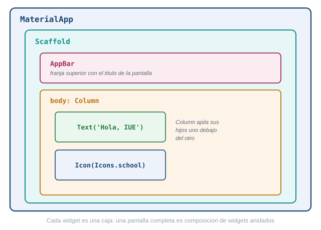
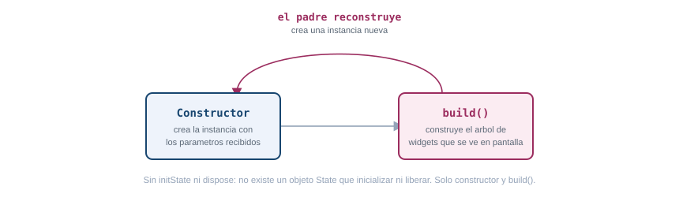
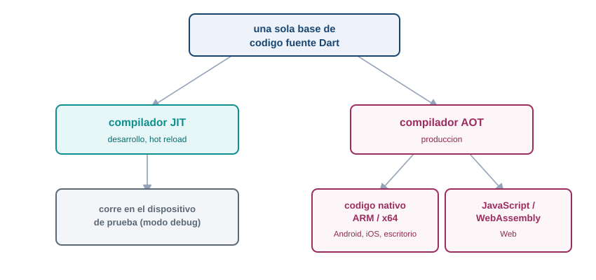

[Diapositivas de esta guía](presentacion-arquitectura-flutter.qmd)

## Qué problema resuelve Flutter

Antes de este tema ya creaste un proyecto Flutter, lo corriste en un emulador y le diste estado
propio con `setState`. Funcionó, pero probablemente lo hiciste sin preguntarte qué pasaba detrás de
cada línea. Esta guía responde esa pregunta: cómo está construido Flutter por dentro, para que
dejes de escribir widgets a ciegas y empieces a entender por qué se comportan como se comportan.

El problema que resuelve Flutter es concreto: una empresa que quiere una app en Android, en iOS,
tal vez también en web y en escritorio, necesita hoy equipos separados por plataforma, cada uno con
su propio lenguaje, su propio conjunto de bugs y su propio calendario de entregas. Flutter propone
una sola base de código en Dart que produce apps nativas para las seis plataformas que soporta.

Esa promesa suena simple, pero cumplirla no es trivial: si Flutter delegara el dibujo de la
interfaz en los controles nativos de cada sistema operativo, arrastraría las inconsistencias entre
plataformas que ese mismo objetivo busca evitar. La solución que eligió el equipo de Flutter fue
más radical: no reutilizar los widgets nativos de ningún sistema operativo, sino traer su propio
motor de dibujo y renderizar cada píxel por su cuenta. Entender por qué esa decisión funciona, y
qué capas hacen falta para sostenerla, es el objetivo de esta guía. Ninguna parte de lo que sigue
es código para copiar: es el mapa conceptual que necesitas antes de seguir construyendo pantallas.

## Arquitectura en capas: framework, engine y embedder

Flutter se organiza en tres capas apiladas, cada una construida sobre la de abajo. De arriba hacia
abajo: el framework, el engine y el embedder.

::: {.diagrama}
{fig-alt="Tres capas de Flutter apiladas: el framework en Dart arriba, con sus subcapas foundation, rendering, widgets y Material o Cupertino; el engine en C++ en medio, con dart:ui, Impeller o Skia y los canales de plataforma; y el embedder específico de cada sistema operativo abajo"}

Framework en Dart, engine en C++, embedder específico de cada plataforma.
:::

### El framework, escrito en Dart

El framework es la capa que tocas todos los días: es Dart puro, y es donde vive el código que
escribes en `lib/main.dart`. Por dentro se organiza en subcapas, cada una construida sobre la
anterior:

- **foundation.** Las clases y servicios base que usa todo lo demás.
- **rendering.** El árbol de objetos que calculan tamaño, posición y pintado (`RenderObject`), con
  el modelo de constraints que ves más adelante en esta guía.
- **widgets.** Las descripciones inmutables y reactivas de la interfaz: la capa donde vive casi
  todo lo que escribes.
- **Material y Cupertino.** La capa de diseño visual: los widgets que imitan el estilo de Android
  (Material Design) o de iOS (Cupertino), construidos encima de todo lo anterior.

Junto a estas se ubican `animation`, `painting` y `gestures`, tres librerías de la capa
fundacional que dan soporte a animaciones, dibujo de bajo nivel y reconocimiento de gestos.

### El engine, escrito en C++

El engine es la capa intermedia, escrita en C++. Expone al framework una interfaz llamada
`dart:ui` y se encarga de todo lo que Dart por sí solo no puede hacer: correr el runtime del
lenguaje, compilarlo, calcular el layout de texto, ofrecer primitivas gráficas, manejar entrada y
salida de archivos y de red, y rasterizar cada frame para entregarlo a la GPU. El engine también
aloja los canales de plataforma (platform channels) y FFI, los mecanismos que usa Flutter para
comunicarse con código nativo cuando lo necesita, por ejemplo para leer un sensor del teléfono.

El rasterizado lo hace un motor de gráficos que vive dentro del engine. Durante varios años ese
motor fue Skia, pero desde Flutter 3.27 Impeller es el motor por defecto en iOS (el único
disponible, sin opción de volver a Skia) y en Android con API 29 o superior (con Vulkan disponible;
si el dispositivo no lo soporta, cae a OpenGL). Desde Flutter 3.47 Impeller también es el motor por
defecto en macOS, Linux y Windows, aunque en escritorio todavía existe una bandera para volver a
Skia, una opción que la documentación oficial anuncia que va a desaparecer. La excepción es Flutter
Web: en 2026 sigue usando Skia compilado a WebAssembly, sin fecha confirmada de migración a
Impeller.

### El embedder, específico de cada plataforma

El embedder es la capa más baja, y es la única que cambia por completo según el sistema operativo.
En Android está escrito en Java o Kotlin más C++; en iOS y macOS, en Swift u Objective-C; en
Windows y Linux, en C++; en la web, se compila a JavaScript o WebAssembly. Su trabajo es alojar el
engine dentro del ciclo de vida nativo de cada plataforma: gestionar la ventana o la actividad,
recibir la entrada del usuario (toques, teclado, mouse), conectarse al bucle de eventos del sistema
operativo y entregarle a la GPU la superficie donde Flutter va a dibujar.

### Por qué Flutter dibuja sus propios píxeles

La alternativa más obvia a esta arquitectura sería que Flutter tradujera cada widget a un control
nativo del sistema operativo: un botón de Flutter se convertiría en un `UIButton` en iOS o en un
`Button` de Android. Esa es, de hecho, la estrategia de otros frameworks multiplataforma. Flutter
la descarta y en su lugar dibuja cada píxel por su cuenta, con su propio motor gráfico, y la
documentación oficial explica esta decisión con tres argumentos:

- **Consistencia.** El mismo píxel se ve igual en todas las plataformas y en todas las versiones de
  sistema operativo, porque no depende de cómo cada fabricante implemente sus controles nativos.
- **Rendimiento.** No hay una capa de traducción entre el widget de Flutter y un control nativo:
  el código Dart compilado corre directo y renderiza directo a la GPU.
- **Extensibilidad.** Cualquier desarrollador puede crear un widget completamente nuevo, con
  cualquier apariencia, sin las restricciones que impone un kit de controles nativos.

Esta decisión es la raíz de todo lo que viene después en esta guía: si Flutter dibuja sus propios
píxeles, necesita su propio pipeline completo (build, layout, paint, composite y rasterizado, que
ves más adelante) y su propia forma de representar la interfaz antes de convertirla en píxeles: los
tres árboles de la siguiente sección.

## Los tres árboles: widgets, elements y render objects

Cuando escribes una pantalla en Flutter, en apariencia estás describiendo un solo árbol de
widgets. Por debajo, Flutter mantiene tres árboles paralelos que colaboran: el árbol de widgets, el
árbol de elements y el árbol de render objects.

::: {.diagrama}
{fig-alt="Tres árboles paralelos de Flutter en una cadena Center, Padding, MiWidget e Icon: el árbol de widgets y el de elements tienen los cuatro nodos, porque todo widget genera un element; el árbol de render objects solo tiene tres, porque MiWidget es un StatelessWidget sin render object propio y el de Icon se conecta directo con el de Padding, su ancestro más cercano que sí tiene uno"}

El widget describe, el element persiste y guarda el estado, el render object calcula y pinta.
:::

Un **widget** es una descripción inmutable de configuración. "Inmutable" quiere decir que, una vez
creado, no cambia: si algo en la interfaz necesita verse distinto, Flutter no modifica el widget
existente, crea uno nuevo. Esto pasa constantemente, cada vez que se ejecuta `build()`, y por eso
los widgets están diseñados para ser baratos de crear y de destruir. La consecuencia directa de
la inmutabilidad es que un widget no puede recordar nada por sí mismo: no guarda su posición en la
jerarquía ni conserva ningún dato de un frame al siguiente.

Ahí entra el **element**. Un element es una instancia mutable que persiste entre frames, y funciona
como puente entre la configuración (el widget) y la implementación visual (el render object). Cada
element retiene la estructura lógica del árbol, y si el widget correspondiente tiene estado, es el
element el que guarda el objeto `State` asociado. El `BuildContext` que recibe cada `build()` es,
en realidad, una referencia a ese element: por eso te sirve para ubicar dónde está un widget dentro
del árbol y para acceder a recursos que proveen los widgets ancestros.

El **render object** es el que hace el trabajo pesado: calcula tamaño, posición y pintado en
coordenadas visuales absolutas. No todo widget genera un render object, solo los que heredan de
`RenderObjectWidget`; muchos widgets son puramente de composición y no tienen contraparte directa
en este árbol. Por eso el árbol de render objects es más pequeño que el árbol de elements, no una
copia exacta de él.

### Por qué no basta un solo árbol

Se podría pensar que tres árboles son una complicación innecesaria: por qué no colapsar todo en
una sola estructura. La documentación oficial de Flutter da tres razones para no hacerlo.

Primero, rendimiento: cuando algo cambia en el layout, Flutter solo necesita recorrer el árbol de
render objects, que es más pequeño gracias a la composición. Segundo, separación de
responsabilidades: el protocolo de los widgets y el protocolo de los render objects se especializan
cada uno en su tarea, lo que reduce la superficie de la API y el riesgo de errores. Tercero,
seguridad de tipos: el árbol de render puede garantizar en tiempo de ejecución que sus hijos usan
el sistema de coordenadas correcto, mientras que los widgets de composición pueden ser agnósticos a
ese detalle.

Hay además un motivo práctico: los widgets manejan coordenadas lógicas (dependientes de si el
idioma se lee de izquierda a derecha o al revés), mientras que los render objects trabajan siempre
en coordenadas visuales absolutas, izquierda y derecha fijas. Esa conversión ocurre una sola vez,
justo en el traspaso del árbol de widgets al árbol de render, y no se repite en cada layout o cada
pintado, que ocurren con mucha más frecuencia que un build completo.

Cuando el estado cambia, por ejemplo con `setState`, Flutter no recorre todo el árbol comparando
cada nodo contra su versión anterior. Marca como sucio (dirty) el element correspondiente, y en la
siguiente fase de build recorre solo los elements sucios, saltándose los que no cambiaron. La
reconciliación tampoco es un diffing completo del árbol: para cada lista de hijos, Flutter compara
tipo en tiempo de ejecución y `key` con un algoritmo lineal. Si el widget nuevo es idéntico por
referencia al anterior, el recorrido se corta ahí mismo. Si tipo y key coinciden, el element
existente se actualiza con la nueva configuración y conserva su `State` y su render object, sin
recrearlos. Si no coinciden, el element viejo se descarta y se crea uno nuevo. Este mecanismo es
el que permite que un widget padre construya una instancia nueva de un widget hijo en cada build
sin que ese hijo pierda su estado interno: Flutter encuentra y reutiliza el `State` correcto por su
cuenta.

::: {.callout-tip}
## Reto 1. Por qué el estado sobrevive

Un widget se reconstruye por completo en cada `build()`: la instancia anterior desaparece y se crea
una nueva. Aun así, si ese widget tiene estado (por ejemplo, un contador con `setState`), ese
estado no se pierde entre reconstrucciones. Con lo que acabas de leer sobre los tres árboles,
explica por qué el estado sobrevive aunque el widget se destruya y se vuelva a crear en cada build.
No escribas código: responde con el mecanismo, en un párrafo.
:::

::: {.callout-note collapse="true"}
## Solución del Reto 1

El estado no vive en el widget, vive en el element. El widget es solo una descripción inmutable que
se recrea en cada build, pero el element que lo representa persiste entre frames. Cuando Flutter
reconstruye el árbol, compara el widget nuevo con el anterior por tipo en tiempo de ejecución y por
`key`: si coinciden, el element existente se actualiza con la configuración nueva pero conserva el
mismo objeto `State` que ya tenía, con todos sus valores intactos. El widget muere y renace en cada
build; el element, y el `State` que guarda, sobreviven mientras el tipo y la key sigan coincidiendo.
:::

## Todo es un widget: composición sobre herencia

La filosofía central de Flutter es que todo elemento de interfaz es un widget. No solo lo que ves
en pantalla (un texto, un botón, un icono): también el espaciado es un widget (`Padding`), la
alineación es un widget (`Center`), la animación es un widget (`AnimatedContainer`). Esto es una
decisión de diseño deliberada: en vez de que un botón tenga una propiedad interna para su relleno,
envuelves ese botón con un widget `Padding` que le agrega ese comportamiento desde afuera.

Esta forma de trabajar se llama composición, y se opone a la herencia. En un modelo por herencia,
para agregarle una capacidad a un componente extenderías su clase y sobrescribirías métodos. En un
modelo por composición, envuelves el componente con otro widget más especializado, sin tocar el
original. Flutter eligió composición de forma consistente en toda su API: una interfaz compleja no
es una clase gigante con muchas propiedades, es un árbol de widgets pequeños, cada uno con una sola
responsabilidad, combinados unos dentro de otros.

::: {.diagrama}
{fig-alt="Ejemplo de composición en Flutter: un botón con relleno y centrado se arma envolviendo el botón original con un widget Padding y ese resultado con un widget Center, en vez de agregar propiedades al botón"}

Cada widget agrega una sola capacidad, envolviendo al anterior.
:::

### StatelessWidget frente a StatefulWidget

Dentro de esta filosofía, todo widget cae en una de dos categorías.

Un `StatelessWidget` nunca cambia una vez construido. Su apariencia depende solo de los parámetros
que recibió al crearse: si esos parámetros no cambian, el widget se ve siempre igual. `Icon`,
`IconButton` y `Text` son ejemplos oficiales.

Un `StatefulWidget` es dinámico: puede cambiar su apariencia en respuesta a una interacción del
usuario o a la llegada de nuevos datos. `Checkbox`, `Radio`, `Slider`, `InkWell`, `Form` y
`TextField` son ejemplos oficiales. La clave de su dinamismo es que el estado mutable no vive en el
widget mismo (que sigue siendo inmutable, como todos), sino en un objeto `State` separado, asociado
al element como viste en la sección anterior. Esa separación es la que permite que el widget siga
siendo una descripción liviana mientras el estado persiste aparte.

::: {.diagrama}
{fig-alt="Comparación entre StatelessWidget, que no guarda estado y se ve siempre igual mientras no cambien sus parámetros, y StatefulWidget, cuyo estado mutable vive aparte en un objeto State asociado al element"}

El StatelessWidget no guarda nada; el StatefulWidget delega su estado a un objeto State aparte.
:::

La forma general de un `StatelessWidget` es mínima:

```dart
class Saludo extends StatelessWidget {
  const Saludo({super.key});

  @override
  Widget build(BuildContext context) {
    return const Text("Hola");
  }
}
```

No hay más que eso: una clase, un constructor y un método `build()`.

### build() y BuildContext

Todo widget, sea Stateless o Stateful, implementa un método `build()` que describe la parte de la
interfaz que le corresponde, devolviendo un árbol de widgets más básicos. En un `StatelessWidget`,
`build()` vive en la propia clase del widget. En un `StatefulWidget`, `build()` vive dentro del
objeto `State`, no en la clase del widget: por eso `_MyHomePageState`, que ya viste en el Tema 2,
tiene su propio `build()` separado de `MyHomePage`.

`build()` recibe un `BuildContext` como parámetro. Ya viste en la sección anterior que el
`BuildContext` es, en el fondo, una referencia al element: le dice al widget dónde está ubicado
dentro del árbol, y por eso le permite acceder a información o recursos que proveen sus ancestros
(un `Theme`, un `Navigator`, un `MediaQuery`) sin que esos ancestros necesiten conocer a sus
descendientes. Es una vía de comunicación de arriba hacia abajo, no al revés.

## Ciclo de vida de un StatelessWidget

Antes de ver el ciclo completo de un `StatefulWidget`, vale la pena mirar el caso simple. Un
`StatelessWidget` no tiene pasos intermedios porque no existe ningún objeto `State` que crear,
inicializar ni liberar: su ciclo se reduce a dos momentos.

::: {.diagrama}
{fig-alt="Ciclo de vida de un StatelessWidget: el constructor crea la instancia con sus parámetros y build construye el árbol de widgets que se ve en pantalla. No hay initState ni dispose porque no existe un objeto State que inicializar ni liberar. Cuando el padre reconstruye esa parte del árbol, se crea una instancia nueva y el ciclo empieza de nuevo desde el constructor"}

Constructor y build(), nada más. Sin initState ni dispose: no hay State que inicializar ni liberar.
:::

- **Constructor.** Crea la instancia del widget con los parámetros que recibió. Ocurre cada vez
  que su padre reconstruye esa parte del árbol: no es un paso que corra "una vez", como
  `initState()` en un `StatefulWidget`, sino cada vez que hace falta una descripción nueva.
- **`build()`.** El framework lo llama para obtener el árbol de widgets que representa. No hay una
  ejecución inicial separada de las siguientes: cada reconstrucción del padre crea un widget nuevo
  y llama a su `build()` de nuevo.

No hay equivalente a `setState()` ni a `dispose()`. Sin un objeto `State` que guarde nada entre
reconstrucciones, no hay un valor que actualizar ni un recurso propio que cancelar o liberar antes
de que el widget desaparezca del árbol.

## Ciclo de vida de un StatefulWidget

Ya viste el caso simple. Un `StatefulWidget` agrega pasos porque, a diferencia del `StatelessWidget`,
sí tiene un objeto `State` que crear, inicializar y liberar aparte del widget. Falta ver cuándo
ocurre cada paso de ese ciclo.

::: {.diagrama}
{fig-alt="Secuencia del ciclo de vida de un StatefulWidget: createState se llama una vez, luego initState una vez, luego build al menos una vez y cada vez que setState lo dispara, y por último dispose una vez al retirar el widget del árbol"}

createState e initState corren una vez. build se repite con cada setState. dispose cierra el ciclo.
:::

A nivel conceptual, el ciclo de vida de un `StatefulWidget` sigue esta secuencia:

- **`createState()`.** El framework llama a este método para crear el objeto `State` asociado al
  widget. Ocurre una sola vez, cuando el widget entra al árbol por primera vez.
- **`initState()`.** Se llama una única vez, justo después de crear el `State`. Es el lugar para
  inicializar variables o preparar cualquier cosa que el widget necesite antes de mostrarse.
- **`build()`.** Produce la interfaz visible a partir del estado actual. Se ejecuta al menos una
  vez al principio, y se vuelve a ejecutar cada vez que el estado cambia.
- **`setState()`.** No es parte de la secuencia inicial, es el disparador que la reinicia
  parcialmente: cuando el código de la aplicación llama `setState()` (tras un toque del usuario o
  la llegada de un dato nuevo), le avisa al framework que el estado cambió, y eso provoca que
  `build()` se ejecute otra vez con los valores actualizados. Esto puede repetirse cualquier
  cantidad de veces mientras el widget siga vivo.
- **`dispose()`.** Se llama una única vez, cuando el widget se retira permanentemente del árbol.
  Es el lugar para liberar recursos, cancelar suscripciones o hacer cualquier limpieza pendiente
  antes de que el objeto `State` desaparezca.

La idea que conecta toda esta secuencia con lo que viste en el Tema 2 es que `setState()` no
cambia la pantalla por sí mismo: solo marca el element como sucio, tal como viste en la sección de
los tres árboles. El repintado real ocurre después, en el pipeline de renderizado que ves a
continuación.

## El pipeline de renderizado

Convertir un árbol de widgets en píxeles en pantalla no es un solo paso, son cinco fases
consecutivas: build, layout, paint, composite y rasterizado.

::: {.diagrama}
{fig-alt="Pipeline de renderizado de Flutter en cinco fases consecutivas: build, layout, paint, composite y rasterizado, desde el árbol de widgets hasta los píxeles entregados a la GPU"}

Cinco fases, una sola pasada por fase cuando es posible.
:::

En **build**, cada widget se traduce a un element persistente, y para los que generan render object
(los `RenderObjectWidget`) se crea o se actualiza el nodo correspondiente en el árbol de render. En
**layout**, Flutter recorre el árbol de render y calcula tamaño y posición de cada nodo, con el
modelo de constraints que ves en la siguiente sección. En **paint**, cada render object ya
dimensionado dibuja su apariencia (color, texto, bordes) sobre un canvas. En **composite**, lo
pintado se organiza en layers y se arma una escena completa. En **rasterizado**, esa escena se
convierte en los píxeles concretos que la GPU entrega a la pantalla, con Impeller (o Skia en la
web) como motor.

El principio detrás de este diseño es que cada fase tiene una responsabilidad acotada y recorre el
árbol una sola vez cuando es posible, en vez de acumular pasadas adicionales. Ese principio es
justo el que hace posible el modelo de constraints.

### El modelo de constraints

El layout en Flutter sigue una regla fija, resumida en una frase: las constraints bajan, los
tamaños suben, y el padre decide la posición.

::: {.diagrama}
{fig-alt="Modelo de constraints en Flutter: el padre entrega constraints de ancho y alto mínimo y máximo hacia abajo, el hijo decide su tamaño dentro de esos límites y lo comunica hacia arriba, y el padre decide la posición final del hijo"}

Las constraints bajan, los tamaños suben, el padre decide la posición.
:::

Una constraint es un conjunto de cuatro números: ancho mínimo, ancho máximo, alto mínimo y alto
máximo. El proceso funciona así: el padre le entrega esas constraints a cada hijo (pueden ser
distintas para cada uno); el hijo, respetando esos límites, decide su propio tamaño y lo comunica
hacia arriba; el padre, ya con los tamaños de todos sus hijos, decide dónde posicionar a cada uno.
Ningún widget puede tener el tamaño que quiera libremente, solo el que le permite su padre, y
ningún widget decide por sí mismo su propia posición en pantalla.

Esta negociación ocurre en una sola pasada, de arriba hacia abajo y luego de vuelta hacia arriba,
sin necesidad de recalcular ni de repetir el recorrido. Por eso el costo del layout crece de forma
lineal con el número de nodos, algo que contrasta con modelos como el de CSS en la web, donde
distintos modos de layout (bloque, en línea, flex, grid) pueden requerir varias pasadas y
recálculos frente a un mismo cambio de contenido.

::: {.callout-tip}
## Reto 2. El ancho que no aparece

Un estudiante envuelve un `Container` con `width: 300` dentro de un `Row`, y el ancho que definió
nunca se respeta en pantalla: el `Container` termina más angosto de lo que pidió. Con el modelo de
constraints que acabas de leer, explica por qué puede pasar esto. No es un error de sintaxis ni un
bug de Flutter.
:::

::: {.callout-note collapse="true"}
## Solución del Reto 2

Un widget nunca decide su propio tamaño de forma absoluta, solo dentro de lo que le permiten las
constraints que recibió de su padre. Si el `Row` (o algún widget más arriba en el árbol) le está
pasando al `Container` una constraint de ancho máximo menor a 300, el `Container` no puede salirse
de ese límite por más que su propiedad `width` diga 300: las constraints bajan y mandan. El
`width: 300` es una preferencia que el `Container` intenta cumplir, pero solo dentro del rango que
le impuso su padre. Para confirmar la causa exacta habría que revisar qué constraints está
entregando el widget padre, no el `Container` en sí.
:::

Todo lo que has visto hasta acá (árboles paralelos, composición sobre herencia, ciclo de vida,
pipeline de una sola pasada) converge en la misma idea: una interfaz de Flutter nunca es un widget
aislado, es una jerarquía de piezas pequeñas que se comunican con reglas estrictas y predecibles en
cada dirección.

::: {.diagrama}
{fig-alt="Vista general de una interfaz de Flutter como jerarquía de piezas pequeñas comunicadas con reglas estrictas y predecibles: composición sobre herencia, ciclo de vida y pipeline de una sola pasada trabajando juntos"}

Una interfaz de Flutter nunca es un widget aislado, es una jerarquía de piezas pequeñas.
:::

## Compilación multiplataforma: JIT en desarrollo, AOT en producción

Todo lo anterior explica cómo Flutter convierte widgets en píxeles dentro de un dispositivo. Falta
la última pieza: cómo el mismo código Dart llega a correr, con rendimiento cercano al nativo, en
Android, en iOS, en escritorio y en la web.

::: {.diagrama}
{fig-alt="Compilación multiplataforma de Flutter: en desarrollo la Dart VM compila con JIT y permite recarga en caliente, en producción el compilador AOT traduce a código nativo ARM o x64 antes de arrancar, y en la web dartdevc sirve para desarrollo mientras dart2js o dart2wasm compilan para producción"}

JIT con recarga en caliente en desarrollo, AOT nativo en producción, dart2js o dart2wasm en la web.
:::

En desarrollo, cuando corres `flutter run` en modo debug, Dart se compila con un compilador Just In
Time (JIT): la Dart VM traduce el código en tiempo de ejecución. Esto permite recompilación
incremental, y esa es la base técnica de la recarga en caliente que ya usaste en el Tema 2:
Flutter inyecta el código nuevo en la app que sigue corriendo, sin reiniciarla. El modo debug
prioriza velocidad de iteración sobre rendimiento: no está optimizado para producción.

En producción, con `flutter build` o `flutter run --release`, Flutter cambia a Ahead Of Time (AOT):
el compilador traduce el código Dart directo a código máquina nativo (ARM o x64) antes de que la
app arranque, con eliminación del código que no se usa (tree shaking). Ya no hay intérprete
corriendo en tiempo real, solo instrucciones nativas listas para la CPU, y por eso la recarga en
caliente deja de estar disponible en modo release.

Flutter Web sigue una lógica parecida pero con destinos distintos: en desarrollo usa `dartdevc`,
que también permite recarga en caliente dentro del navegador; en producción compila a JavaScript
optimizado con `dart2js`, o de forma alternativa a WebAssembly con `dart2wasm`. El soporte de Wasm
es estable desde Flutter 3.24, pero en 2026 sigue siendo una opción que hay que pedir de forma
explícita con la bandera `--wasm`, no el destino de compilación por defecto; además, no todos los
navegadores lo soportan igual de bien: Chrome lo soporta de forma estable desde su versión 119,
mientras que Safari en iOS todavía no.

Este modelo dual (mismo lenguaje, semántica casi idéntica en todos los modos) es lo que sostiene la
promesa con la que abrió esta guía: una sola base de código Dart, escrita una vez sobre el
framework que ya conoces, corre en las plataformas que Flutter soporta sin reescribirse, con
rendimiento cercano al nativo porque en ningún punto del camino hay un intérprete de HTML y CSS
ajeno a la app, ni un puente que serialice mensajes hacia controles nativos: el código Dart
compilado dibuja directo, con el motor propio que viste al principio de esta guía.

::: {.callout-tip}
## Reto 3. Por qué el hot reload desaparece en producción

Un compañero de curso pregunta por qué la recarga en caliente funciona perfecto durante el
desarrollo, pero no existe en la versión final que se instala en un teléfono. Con lo que acabas de
leer sobre JIT y AOT, explica la razón técnica, sin usar la palabra "porque sí".
:::

::: {.callout-note collapse="true"}
## Solución del Reto 3

La recarga en caliente depende de que exista un intérprete corriendo en el dispositivo mientras la
app está viva: eso es exactamente lo que hace la Dart VM en modo JIT, y es lo que le permite
inyectar código nuevo sobre la app que ya está corriendo, sin reiniciarla. En producción, Flutter
compila con AOT: el código Dart ya se convirtió en instrucciones nativas antes de que la app
arrancara, no hay intérprete corriendo, solo binario ejecutándose directo en la CPU. Sin
intérprete, no hay dónde inyectar código nuevo en caliente: cualquier cambio necesita una
compilación completa y una nueva instalación.
:::

## Del Tema 2 a lo que sigue

Todo lo que viste acá ya estaba presente, sin que lo notaras, en el `_MyHomePageState` que
construiste el tema anterior. El `StatefulWidget` con su `State` separado, el `setState()` que
marca el element como sucio, el `build()` que se vuelve a ejecutar y produce un árbol nuevo de
widgets: esa app mínima con un contador ya recorría, en cada toque de pantalla, el ciclo completo
de esta guía, desde el widget hasta el píxel.

Lo que sigue en el curso construye sobre estos cimientos, no al lado de ellos. Cuando trabajes con
Material Design y con la librería más amplia de widgets de Flutter, cada `Scaffold`, cada
`Column`, cada `ListView` que uses es, otra vez, composición sobre herencia: piezas pequeñas
combinadas siguiendo las mismas reglas de constraints y del mismo pipeline que ya conoces. Entender
la arquitectura no fue un desvío antes de programar interfaces: es la base que te permite leer
cualquier widget nuevo con el que te encuentres el resto del semestre, y saber por qué se comporta
como se comporta.

## Recursos

- Visión arquitectónica oficial de Flutter: <https://docs.flutter.dev/resources/architectural-overview>
- Inside Flutter, sobre los tres árboles y la reconciliación: <https://docs.flutter.dev/resources/inside-flutter>
- Modelo de constraints en el layout: <https://docs.flutter.dev/ui/layout/constraints>
- Modos de compilación (JIT y AOT): <https://docs.flutter.dev/testing/build-modes>
- Impeller, el motor de renderizado: <https://docs.flutter.dev/perf/impeller>

::: {.pie-doc}
Lenguajes de computación para móviles. Fundación Universitaria María Cano. Facultad de Ingeniería.
Semestre 2026-02.

**Transparencia.** La redacción de esta guía contó con el apoyo de inteligencia artificial,
usando el modelo Claude Sonnet 5 de Anthropic. Todo el contenido fue revisado y validado.
:::
