::: {.ficha}
|        |                                                                                          |
|--------|------------------------------------------------------------------------------------------|
| Unidad | Unidad 2. Herramientas de trabajo en desarrollo de aplicaciones para dispositivos móviles |
| Tema   | Tema 2. Flutter y Dart                                                                    |
:::

## Lo que vas a lograr

1. Creas y ejecutas un proyecto Dart puro desde la terminal, y explicas para qué sirve cada
   archivo que genera.
2. Escribes programas en Dart usando variables, tipos, colecciones, null safety, funciones y
   programación orientada a objetos.
3. Usas `async`, `await` y `Future` para explicar por qué Flutter necesita asincronía y qué pasa
   si no la usas.
4. Creas un proyecto Flutter desde terminal y explicas la función de cada carpeta y archivo que
   genera.
5. Ejecutas la app en un emulador, usas la recarga en caliente y modificas la pantalla para que
   tenga estado propio con `setState`.
6. Reconoces características modernas de Dart 3 (records, patrones, clases selladas) y los
   extension methods, para leer código Flutter actual sin sorpresas.

## Qué es Dart y por qué lo ves antes que Flutter

Dart es un lenguaje de programación de propósito general, creado por Google y presentado en 2011.
Es de tipado estático: el compilador revisa los tipos antes de correr el programa. Es orientado a
objetos y trae soporte nativo para programación asíncrona.

Dart se ejecuta de dos formas. Compilado a código de máquina nativo (AOT, ahead of time) para
producción: así queda la versión que instala un usuario real, rápida de arrancar y liviana.
Interpretado por una máquina virtual (JIT, just in time) mientras programas: así es como Dart
inyecta tus cambios en la app que ya está corriendo, sin reiniciarla. Esa segunda forma es el
mecanismo detrás de la recarga en caliente.

Flutter es un framework de interfaz escrito en Dart. Cada widget es, por debajo, una clase de Dart
con un método `build()`. Sin dominar la sintaxis del lenguaje, un error de Flutter es difícil de
ubicar: puede venir del framework o del lenguaje que lo sostiene. Por eso esta guía dedica casi
toda la sesión a Dart puro, sin pantallas de por medio, y deja la creación del primer proyecto
Flutter para el final.

Dart también se usa fuera de Flutter: compila a JavaScript para correr en el navegador, y sirve
para escribir herramientas de línea de comandos o servidores HTTP simples con las plantillas `web`
y `server-shelf`.

Las versiones que usa esta guía son las que quedaron instaladas y verificadas el tema anterior con
`flutter doctor`:

::: {.calendario}
| Herramienta | Versión probada |
|---|---|
| Flutter SDK | 3.41.9 (canal stable) |
| Dart SDK | 3.11.5 |
| DevTools | 2.54.2 |
:::

## Parte 1. El lenguaje Dart

Esta parte recorre Dart en el mismo orden en que lo vas a necesitar: primero creas un proyecto y
aprendes a ejecutarlo, luego los datos (variables, tipos, colecciones), luego cómo tomar
decisiones y repetir código (control de flujo, funciones), luego cómo agrupar datos y
comportamiento (clases), y por último la asincronía, que es la razón por la que Flutter existe tal
como lo conoces. Ningún tema depende de Flutter todavía: todo corre en la terminal, con `dart run`.

### [1]{.paso} Crea tu primer proyecto Dart

Dart tiene su propio comando de creación de proyectos, independiente de Flutter. Ábrelo en una
terminal para confirmar que sigue instalado desde el tema anterior:

```bash
dart --version
```

```text
Dart SDK version: 3.11.5 (stable) (Wed Apr 15 00:36:32 2026 -0700) on "windows_x64"
```

Ahora crea un proyecto de consola. Hazlo en una carpeta de trabajo aparte, no dentro de
`hola_iue`, la carpeta del proyecto Flutter:

```bash
dart create -t console hola_dart
```

La bandera `-t console` pide la plantilla de aplicación de consola, la más simple. Si la omites,
`dart create` usa `console` por defecto. Dart ofrece cinco plantillas: `cli` (línea de comandos con
parseo de argumentos), `console` (la que acabas de usar), `package` (una librería reutilizable, sin
punto de entrada), `server-shelf` (un servidor HTTP mínimo) y `web` (una app web con las librerías
núcleo de Dart, sin Flutter).

::: {.diagrama}
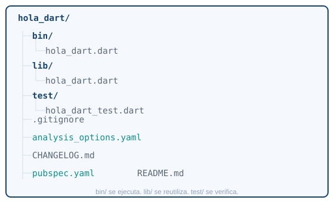{fig-alt="Estructura de carpetas que genera dart create: carpetas bin, lib y test, mas los archivos pubspec.yaml, analysis_options.yaml, gitignore, CHANGELOG y README"}

`bin/` guarda lo que se ejecuta. `lib/` guarda lo que se reutiliza. `test/` guarda las pruebas.
:::

::: {.calendario}
| Archivo o carpeta | Para qué sirve |
|---|---|
| `bin/hola_dart.dart` | El punto de entrada: el `main()` que corres desde terminal |
| `lib/hola_dart.dart` | Código reutilizable, pensado para importarse desde otros archivos |
| `test/hola_dart_test.dart` | Pruebas automáticas del código de `lib/` |
| `pubspec.yaml` | Nombre, versión y dependencias del proyecto |
| `analysis_options.yaml` | Reglas del analizador estático (avisos de estilo y errores) |
| `.gitignore` | Qué carpetas no debe versionar Git (`.dart_tool/`, `build/`) |
| `CHANGELOG.md` | Historial de cambios del paquete, si lo publicas en pub.dev |
| `README.md` | Descripción del proyecto |
:::

`pubspec.yaml` es el manifiesto del proyecto. Ábrelo y vas a ver algo como esto:

```yaml
name: hola_dart
description: Un proyecto de ejemplo en Dart.
version: 1.0.0

environment:
  sdk: ^3.11.5

dev_dependencies:
  lints: ^5.0.0
  test: ^1.24.0
```

`name` identifica el paquete. `environment.sdk` fija qué versiones del SDK de Dart acepta el
proyecto. `dependencies` (todavía no aparece aquí) son los paquetes que tu programa necesita para
funcionar; `dev_dependencies` son los que solo hacen falta mientras desarrollas (linters, pruebas)
y no se incluyen si publicas el paquete. Para agregar una dependencia no edites el archivo a mano.
`http` es el paquete oficial de Dart para hacer peticiones web (`GET`, `POST`...), y sirve aquí
como ejemplo real de cómo se agrega una dependencia:

```bash
dart pub add http
```

Ese comando escribe la línea en `pubspec.yaml` y descarga el paquete. La notación de versiones
sigue [semver](https://semver.org/) (MAYOR.MENOR.PARCHE):

::: {.calendario}
| Notación | Significado |
|---|---|
| `^1.1.0` | Desde 1.1.0 hasta (sin incluir) 2.0.0: compatible dentro del mismo MAYOR |
| `>=1.0.0 <2.0.0` | Rango explícito |
| `1.1.0` | Exactamente esa versión, nunca otra |
| `any` | Cualquier versión; evítalo, hace el proyecto impredecible |
:::

Abre `bin/hola_dart.dart` en tu editor. Vas a usar ese archivo como cuaderno de pruebas durante
toda la Parte 1: pega ahí cada ejemplo de esta guía y corre el programa para ver qué imprime. El
archivo trae por defecto un `main()` con un `print()`; bórralo y empieza desde cero.

### [2]{.paso} Ejecuta y verifica

```bash
dart run
```

Sin argumentos, `dart run` busca automáticamente `bin/hola_dart.dart` (el archivo con el mismo
nombre del proyecto): es justo lo que la propia terminal te sugiere al terminar `dart create`. Si
quieres correr un archivo distinto, pásale la ruta:

```bash
dart run bin/otro_archivo.dart
```

Cada vez que cambies el archivo, vuelve a correr el comando. No hay recarga en caliente en Dart
puro, eso es exclusivo de Flutter: la verás en la Parte 2.

Cuando el programa esté listo para repartirse sin que quien lo reciba necesite el SDK de Dart
instalado, compílalo a un ejecutable nativo:

```bash
dart compile exe bin/hola_dart.dart -o hola_dart.exe
```

```bash
./hola_dart.exe
```

`dart compile exe` genera un binario independiente para tu sistema operativo. Arranca más rápido
que `dart run` porque ya no compila nada al ejecutarse, pero el ejecutable solo funciona en el
sistema operativo donde lo compilaste.

Tres comandos que vas a usar todo el semestre, incluso dentro de proyectos Flutter:

```bash
dart format .
```

Reordena la indentación y los espacios del proyecto completo según el estilo oficial de Dart. No
cambia la lógica, solo la forma.

```bash
dart analyze
```

Revisa el código en busca de errores y avisos de estilo sin ejecutarlo. Córrelo antes de dar por
terminado un ejercicio: es la forma más rápida de encontrar un error de tipos antes de correr el
programa.

```bash
dart test
```

Corre las pruebas de `test/`. Todavía no vas a escribir pruebas, pero el comando ya funciona con
el proyecto recién creado.

### Variables y tipos

Dart es de tipado estático: cada variable tiene un tipo, y el compilador lo revisa antes de correr
el programa. La diferencia entre `var`, `final` y `const` no es de tipo, es de qué tan pronto se
fija el valor.

::: {.diagrama}
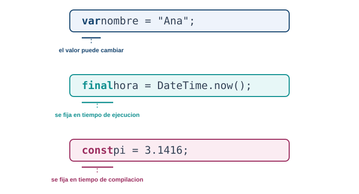{fig-alt="Comparacion entre var, final y const en Dart: cuando usar cada palabra clave segun si el valor cambia y si se conoce en tiempo de compilacion"}

`var` cambia. `final` se fija al ejecutar. `const` se fija antes de ejecutar.
:::

```dart
var nombre = "Ana";       // el tipo se infiere como String
nombre = "Luis";          // valido: var admite reasignacion

final horaDeInicio = DateTime.now();  // se conoce solo al ejecutar
// horaDeInicio = DateTime.now();     // error: no se puede reasignar

const limiteDeIntentos = 3;  // se conoce antes de ejecutar el programa
```

Cuando declaras con tipo explícito en vez de dejar que Dart lo infiera, se ve así:

```dart
String nombre = "Ana";
int edad = 21;
double promedio = 4.35;
bool activo = true;
```

Los tipos básicos que vas a usar todo el semestre:

::: {.diagrama}
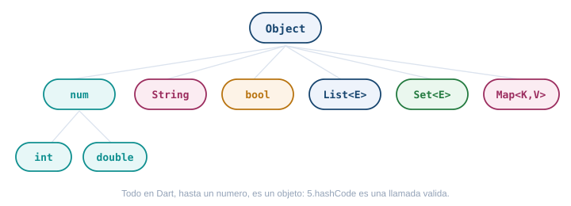{fig-alt="Jerarquia de los tipos basicos de Dart: Object en la raiz, y de ahi num con int y double, String, bool, List, Set y Map"}
:::

`String` admite interpolación, la forma de meter una variable o expresión dentro de un texto sin
concatenar con `+`:

```dart
var nombre = "Ana";
var edad = 21;
print("Hola, $nombre");                 // variable simple: $nombre
print("El próximo año tendrás ${edad + 1}");  // expresión: ${...}
print('Comillas simples y "dobles" adentro'); // ambas comillas son validas
var parrafo = """
Puedes escribir
varias lineas
con comillas triples.
""";
```

Las tres colecciones que vas a usar constantemente:

```dart
// List: una secuencia ordenada, admite repetidos
var materias = <String>["Móvil", "Web", "Redes"];
materias.add("Bases de datos");
print(materias[0]);          // Movil
print(materias.length);      // 4

// Set: una coleccion sin orden garantizado y sin repetidos
var gruposActivos = <int>{601, 602, 603};
gruposActivos.add(601);      // no pasa nada, ya estaba

// Map: pares clave-valor
var creditosPorCurso = <String, int>{
  "Movil": 3,
  "Web": 3,
};
print(creditosPorCurso["Movil"]);  // 3
creditosPorCurso["Redes"] = 2;
```

### Null safety

Desde Dart 2, un tipo nunca admite `null` a menos que lo marques con `?`. Esto elimina de raíz la
excepción más común de cualquier lenguaje con null implícito: intentar usar algo que nunca llegó.

::: {.diagrama}
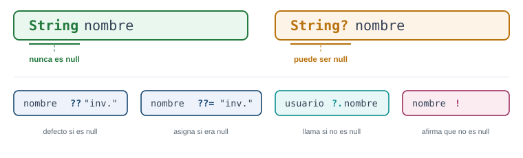{fig-alt="Null safety en Dart: un tipo sin signo de interrogacion nunca admite null, un tipo con signo de interrogacion si lo admite, y los operadores doble interrogacion, interrogacion punto y signo de admiracion para trabajar con valores que pueden ser null"}
:::

```dart
String nombre = "Ana";        // nunca es null, el compilador lo garantiza
String? apodo;                 // puede ser null; aqui empieza como null

print(apodo ?? "sin apodo");   // "sin apodo", porque apodo es null
apodo ??= "Anita";             // asigna solo si apodo seguia en null
print(apodo?.toUpperCase());   // llama toUpperCase solo si apodo no es null

String? entrada = obtenerEntrada();
print(entrada!.length);        // afirma que no es null; si te equivocas, revienta en tiempo de ejecucion
```

Usa `!` solo cuando estés seguro. Si te equivocas, Dart lanza una excepción en ese punto exacto, lo
cual es mejor que un error silencioso más adelante, pero sigue siendo un error que pudiste evitar
con `??` o con un `if (entrada != null)`.

Una variable `late` se declara sin valor inicial pero promete asignarse antes de leerse, típico en
campos que se llenan en un constructor o en `initState`:

```dart
late String token;  // no tiene valor todavia

void configurar() {
  token = "abc123";  // se asigna antes de cualquier lectura
}
```

::: {.callout-tip}
## Reto 1. El registro de la sesión

Vas a llevar el registro de quién entra al laboratorio de hoy. Necesitas guardar:

- El nombre del estudiante que se inscribe: se conoce en el momento de la inscripción y no cambia
  después.
- El cupo máximo del laboratorio: siempre son 20 cupos, un número que ya conoces antes de escribir
  el programa.
- Los intentos de conexión al wifi del salón: empiezan en 0 y van subiendo cada vez que alguien lo
  intenta.
- El enlace del grupo de WhatsApp del grupo: no todos los grupos tienen uno, así que puede faltar.

Declara las cuatro variables con el tipo y la palabra clave correctos (`var`, `final` o `const`, y
`?` donde haga falta), y usa `??` para mostrar "sin grupo asignado" cuando el enlace de WhatsApp no
exista.
:::

::: {.callout-note collapse="true"}
## Solución del Reto 1

```dart
final nombreEstudiante = "Camila"; // se conoce al inscribirse, no cambia despues
const cupoMaximo = 20;             // ya se sabe antes de correr el programa
var intentosDeConexion = 0;        // cambia cada vez que alguien lo intenta
String? enlaceWhatsApp;            // puede faltar

void main() {
  print("Cupo maximo: $cupoMaximo");
  print("Grupo: ${enlaceWhatsApp ?? "sin grupo asignado"}");
}
```

`nombreEstudiante` es `final` porque se calcula una vez, al momento de inscribirse: no lo conoces
antes de correr el programa (por eso no es `const`), pero tampoco cambia después (por eso no es
`var`). `cupoMaximo` es `const` porque el valor 20 está fijo antes de ejecutar. `intentosDeConexion`
es `var` porque literalmente su trabajo es cambiar. `enlaceWhatsApp` necesita el `?` porque no todos
los grupos lo tienen: sin el signo de interrogación, Dart no te dejaría dejarlo sin valor.
:::

### Operadores útiles

El operador cascada `..` te deja encadenar varias llamadas sobre el mismo objeto sin repetirlo:

```dart
var lista = <int>[]
  ..add(1)
  ..add(2)
  ..add(3);
print(lista);  // [1, 2, 3]
```

El operador spread `...` expande una colección dentro de otra, y `...?` hace lo mismo pero
tolerando que la colección de origen sea `null`:

```dart
var base = [1, 2, 3];
var extendida = [0, ...base, 4];   // [0, 1, 2, 3, 4]

List<int>? opcional;
var segura = [0, ...?opcional, 9]; // [0, 9], no revienta aunque opcional sea null
```

Dentro de un literal de colección puedes usar `if` y `for` para construirla condicionalmente:

```dart
bool mostrarExtra = true;
var opciones = [
  "Guardar",
  "Cancelar",
  if (mostrarExtra) "Guardar como plantilla",
];

var cuadrados = [for (var i = 1; i <= 5; i++) i * i];  // [1, 4, 9, 16, 25]
```

### Control de flujo

`if`, `for`, `while` y `do-while` funcionan igual que en la mayoría de lenguajes tipados. Para un
`if` corto que solo elige un valor, usa el operador ternario `condicion ? siVerdadero : siFalso`:

```dart
int temperatura = 22;
String estado = temperatura > 15 ? "calido" : "frio";
print("El clima es $estado");
```

```dart
for (var i = 0; i < 3; i++) {
  print("Vuelta $i");
}

for (var materia in materias) {
  print(materia);
}

var intentos = 0;
while (intentos < 3) {
  intentos++;
}

do {
  intentos--;
} while (intentos > 0);
```

El `switch` clásico compara valores exactos y necesita `break`:

```dart
String describirGrupo(int grupo) {
  switch (grupo) {
    case 601:
      return "Sabado en la manana";
    case 602:
      return "Sabado en la tarde";
    default:
      return "Grupo desconocido";
  }
}
```

Dart 3 agrega el `switch` como expresión, con reconocimiento de patrones. Es más corto y el
compilador te avisa si te falta cubrir un caso:

```dart
String describirGrupo(int grupo) => switch (grupo) {
  601 => "Sabado en la manana",
  602 => "Sabado en la tarde",
  _ => "Grupo desconocido",
};

String clasificarNota(double nota) => switch (nota) {
  >= 4.5 => "Excelente",
  >= 3.0 => "Aprobo",
  _ => "Reprobo",
};
```

Dentro de un bucle, `break` lo interrumpe por completo y `continue` salta a la siguiente vuelta sin
ejecutar el resto del cuerpo:

```dart
for (var i = 0; i < 10; i++) {
  if (i == 5) break;   // termina el for apenas i llega a 5
  print(i);             // imprime 0, 1, 2, 3, 4
}

for (var i = 0; i < 10; i++) {
  if (i % 2 == 0) continue;  // salta los pares
  print(i);                   // imprime solo los impares: 1, 3, 5, 7, 9
}
```

### Funciones

Dart admite tres formas de declarar parámetros, y se combinan en la misma función:

::: {.diagrama}
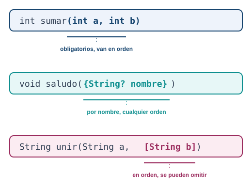{fig-alt="Tres formas de declarar parametros en Dart: posicionales obligatorios, nombrados entre llaves y opcionales posicionales entre corchetes"}
:::

```dart
// posicionales: obligatorios, van en orden
int sumar(int a, int b) => a + b;
sumar(2, 3);

// nombrados: se llaman por nombre, "required" los hace obligatorios
void saludar({required String nombre, bool formal = false}) {
  print(formal ? "Buenos dias, $nombre" : "Hola, $nombre");
}
saludar(nombre: "Ana");
saludar(nombre: "Ana", formal: true);

// opcionales posicionales: van en orden, se pueden omitir
String unir(String a, [String separador = " "]) => "$a$separador...";
unir("Hola");
```

Las funciones son valores de primera clase: las puedes guardar en una variable, pasarlas como
argumento o devolverlas desde otra función. Eso es lo que hace posible `onPressed: miFuncion` en
Flutter.

```dart
void ejecutarDosVeces(void Function() accion) {
  accion();
  accion();
}

void saludoCorto() => print("Hola");
ejecutarDosVeces(saludoCorto);

// funcion anonima, la forma mas comun en Flutter
ejecutarDosVeces(() {
  print("Hola de nuevo");
});
```

Una clausura (closure) es una función que recuerda las variables de su entorno aunque ese entorno
ya haya terminado de ejecutarse:

```dart
Function crearContador() {
  var cuenta = 0;
  return () {
    cuenta++;
    return cuenta;
  };
}

var contador = crearContador();
print(contador());  // 1
print(contador());  // 2
```

::: {.callout-tip}
## Reto 2. El costo del carné

La coordinación te pide una función para calcular cuánto paga cada estudiante por el carné
estudiantil. El costo base son 15000 pesos. Algunos estudiantes tienen descuento (por ejemplo, 20
significa 20% menos), pero la mayoría no tiene ninguno.

Escribe una función `calcularCarne` que reciba el costo base como parámetro obligatorio y el
descuento como parámetro nombrado opcional (0 si no se indica), y que devuelva el costo final.
Pruébala con y sin descuento.
:::

::: {.callout-note collapse="true"}
## Solución del Reto 2

```dart
double calcularCarne(double costoBase, {double descuento = 0}) {
  return costoBase - (costoBase * descuento / 100);
}

void main() {
  print(calcularCarne(15000));               // 15000.0, sin descuento
  print(calcularCarne(15000, descuento: 20)); // 12000.0, 20% menos
}
```

`costoBase` es posicional porque toda llamada lo necesita y no tiene ambigüedad en su orden. El
`descuento` va nombrado y con valor por defecto `0`: así la mayoría de estudiantes, que no tienen
descuento, llaman la función con un solo argumento, y los que sí tienen descuento lo dejan
explícito y claro en la llamada (`descuento: 20`) en vez de un número suelto sin contexto.
:::

### Programación orientada a objetos

Una clase en Dart agrupa campos y métodos. El constructor por defecto tiene el mismo nombre de la
clase, y la sintaxis `this.campo` asigna el argumento directamente al campo sin escribir el cuerpo:

```dart
class Estudiante {
  final String nombre;
  final int grupo;

  Estudiante(this.nombre, this.grupo);  // constructor abreviado

  String presentarse() => "$nombre, grupo $grupo";
}

var ana = Estudiante("Ana", 601);
print(ana.presentarse());
```

Un constructor con nombre te deja ofrecer varias formas de crear el mismo tipo:

```dart
class Punto {
  final double x;
  final double y;

  Punto(this.x, this.y);
  Punto.origen() : x = 0, y = 0;  // constructor con nombre
}

var p1 = Punto(3, 4);
var p2 = Punto.origen();
```

Un constructor `factory` no siempre crea una instancia nueva: puede devolver una ya existente, útil
para singletons o para elegir la subclase correcta según el argumento:

```dart
class Configuracion {
  static Configuracion? _instancia;
  Configuracion._interna();  // constructor privado, con guion bajo

  factory Configuracion() {
    return _instancia ??= Configuracion._interna();
  }
}
```

Getters y setters te dejan exponer un campo calculado como si fuera una propiedad normal:

```dart
class Rectangulo {
  double ancho;
  double alto;

  Rectangulo(this.ancho, this.alto);

  double get area => ancho * alto;
  set area(double nuevaArea) => ancho = nuevaArea / alto;
}

var r = Rectangulo(4, 5);
print(r.area);  // 20, se lee como campo aunque es un metodo
```

Herencia, interfaces y mixins son las tres formas de reutilizar código, y no son intercambiables:

::: {.diagrama}
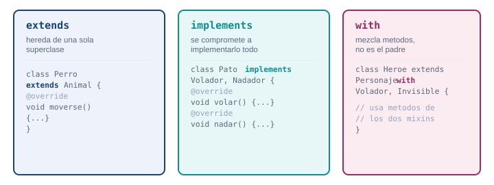{fig-alt="Tres formas de reutilizar codigo en Dart: extends para herencia de una sola superclase, implements para cumplir una interfaz y with para mezclar comportamiento con un mixin"}
:::

```dart
// extends: herencia de una sola superclase
class Animal {
  void moverse() => print("Me muevo");
}

class Perro extends Animal {
  @override
  void moverse() => print("Corro");
}

// abstract class: no se puede instanciar, define el contrato de sus hijos
abstract class Figura {
  double calcularArea();  // sin cuerpo, cada hijo lo implementa
}

class Cuadrado extends Figura {
  final double lado;
  Cuadrado(this.lado);

  @override
  double calcularArea() => lado * lado;
}

// implements: cada clase en Dart es tambien una interfaz implicita
class Pato implements Object {
  @override
  String toString() => "Pato";
}

// mixin: mezcla comportamiento de varias fuentes sin ser su padre
mixin Volador {
  void volar() => print("Vuelo");
}

mixin Nadador {
  void nadar() => print("Nado");
}

class Ganso with Volador, Nadador {}

var g = Ganso();
g.volar();
g.nadar();
```

Los enums clásicos enumeran valores fijos. Desde Dart 2.17, un enum también puede tener campos,
constructor y métodos, lo que evita crear una clase aparte solo para asociar datos a cada valor:

```dart
enum DiaClase { sabadoManana, sabadoTarde, juevesManana }

enum Prioridad {
  baja(1, "Baja"),
  media(2, "Media"),
  alta(3, "Alta");

  final int peso;
  final String etiqueta;
  const Prioridad(this.peso, this.etiqueta);
}

print(Prioridad.alta.etiqueta);  // "Alta"
print(Prioridad.alta.peso);      // 3
```

Dart 3 agrega modificadores de clase para controlar quién puede heredar o implementar un tipo.
Los vas a encontrar leyendo código de paquetes de Flutter, aunque no los necesites para tu
proyecto todavía: `final class` no admite subclases fuera de su propio archivo, `base class`
obliga a que las subclases usen `extends` (no `implements`), `interface class` obliga a que otros
la usen solo con `implements`, y `sealed class` obliga a que un `switch` sobre ella cubra todos los
casos posibles, porque el compilador conoce de antemano cada subclase.

::: {.callout-tip}
## Reto 3. Estudiante becado

Vas a modelar dos tipos de estudiante para el sistema de matrículas. Todo estudiante tiene
`nombre` y `costoMatricula`. Un estudiante becado, además, tiene un `porcentajeBeca` (por ejemplo
50) y su costo final debe salir con ese descuento aplicado.

Crea una clase `Estudiante` con un método `costoFinal()` que por defecto devuelve el costo de
matrícula sin cambios. Crea `EstudianteBecado`, que hereda de `Estudiante` y sobrescribe
`costoFinal()` para aplicar el descuento de la beca.
:::

::: {.callout-note collapse="true"}
## Solución del Reto 3

```dart
class Estudiante {
  final String nombre;
  final double costoMatricula;

  Estudiante(this.nombre, this.costoMatricula);

  double costoFinal() => costoMatricula;
}

class EstudianteBecado extends Estudiante {
  final double porcentajeBeca;

  EstudianteBecado(String nombre, double costoMatricula, this.porcentajeBeca)
      : super(nombre, costoMatricula);

  @override
  double costoFinal() => costoMatricula - (costoMatricula * porcentajeBeca / 100);
}

void main() {
  var ana = Estudiante("Ana", 1200000);
  var luis = EstudianteBecado("Luis", 1200000, 50);

  print(ana.costoFinal());   // 1200000.0
  print(luis.costoFinal());  // 600000.0
}
```

`EstudianteBecado extends Estudiante` hereda `nombre` y `costoMatricula`, y el `super(...)` en el
constructor le pasa esos dos valores al padre. `@override` en `costoFinal()` reemplaza el
comportamiento heredado solo para esta subclase: el resto del programa puede tratar a cualquier
estudiante igual, sin saber si es becado o no, y cada uno calcula su costo a su manera.
:::

### Genéricos y funciones de colección

Un genérico te deja escribir una clase o función que funciona con cualquier tipo, sin perder la
seguridad de tipos:

```dart
class Caja<T> {
  T contenido;
  Caja(this.contenido);
}

var cajaDeTexto = Caja<String>("hola");
var cajaDeNumero = Caja<int>(42);
```

Puedes limitar qué tipos acepta un genérico con `extends`: la clase solo compila con tipos que
cumplan esa restricción, lo que te deja usar operadores que no existen para cualquier `T`:

```dart
class Calculadora<T extends num> {
  T sumar(T a, T b) => (a + b) as T;
}

var calc = Calculadora<int>();
print(calc.sumar(3, 4));  // 7
```

Las colecciones traen métodos funcionales que evitan escribir bucles manuales:

```dart
var notas = [3.2, 4.5, 2.8, 4.9, 3.9];

var aprobados = notas.where((n) => n >= 3.0).toList();
var enTexto = notas.map((n) => n.toStringAsFixed(1)).toList();
var promedio = notas.reduce((a, b) => a + b) / notas.length;
var suma = notas.fold(0.0, (acumulado, n) => acumulado + n);

var ordenadas = [...notas]..sort();  // sort() modifica en el sitio, por eso se copia antes
```

### Extension methods

Un extension method agrega comportamiento a un tipo que ya existe (aunque no sea tuyo, como
`String` o `int`) sin heredar de él ni modificarlo. Evita llenar tu código de funciones sueltas que
reciben el mismo tipo una y otra vez:

```dart
extension StringUtils on String {
  String capitalizar() {
    if (isEmpty) return this;
    return "${this[0].toUpperCase()}${substring(1).toLowerCase()}";
  }

  bool get esCorreo => contains("@") && contains(".");
}

void main() {
  print("hola mundo".capitalizar());  // Hola mundo
  print("ana@iue.edu.co".esCorreo);   // true
}
```

La extensión solo aplica donde la importas: si `StringUtils` vive en otro archivo, necesitas
importarlo para que `"texto".capitalizar()` compile. Dart la resuelve en tiempo de compilación, sin
costo de rendimiento frente a una función normal.

### Asincronía: el corazón de Flutter

Una app nunca puede quedarse congelada esperando una respuesta de red o un archivo: el usuario
sigue tocando la pantalla mientras eso ocurre. Por eso Dart separa el código síncrono, que bloquea
hasta terminar, del código asíncrono, que arranca una tarea y deja que el resto de la app siga
funcionando mientras esa tarea termina en segundo plano.

::: {.diagrama}
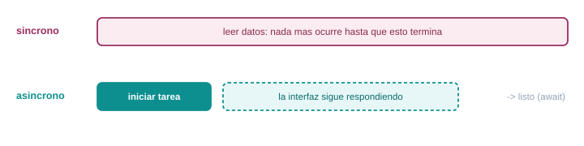{fig-alt="Comparacion entre codigo sincrono, que bloquea la app hasta terminar, y codigo asincrono, que inicia una tarea y deja la interfaz respondiendo mientras espera el resultado"}
:::

Un `Future<T>` representa un valor que todavía no existe, pero que va a existir (o va a fallar) en
algún momento:

```dart
Future<String> obtenerNombreDeUsuario() {
  return Future.delayed(const Duration(seconds: 2), () => "Ana");
}
```

`async` y `await` son la forma legible de trabajar con un `Future`, en vez de encadenar `.then()`:

```dart
Future<void> mostrarSaludo() async {
  print("Buscando el nombre...");
  var nombre = await obtenerNombreDeUsuario();  // aqui se espera, sin bloquear la app
  print("Hola, $nombre");
}
```

::: {.diagrama}
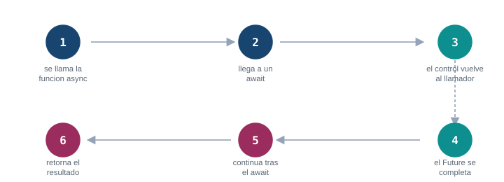{fig-alt="Flujo de async y await en Dart: se llama la funcion, llega a un await, el control vuelve al llamador sin bloquear, el Future se completa, la funcion continua justo despues del await y retorna el resultado"}
:::

Los errores en código `async` se capturan con `try/catch`, igual que en código síncrono. Puedes
capturar un tipo específico de excepción con `on`, y usar `finally` para el código que debe correr
siempre, haya error o no:

```dart
Future<void> cargarDatos() async {
  try {
    var nombre = await obtenerNombreDeUsuario();
    print("Cargado: $nombre");
  } on FormatException catch (error) {
    print("El dato no tenia el formato esperado: $error");
  } catch (error) {
    print("Fallo la carga: $error");
  } finally {
    print("Intento de carga terminado");  // corre siempre
  }
}
```

Antes de que existiera `async`/`await`, el estilo para trabajar con un `Future` era encadenar
`.then()` y `.catchError()`. Todavía lo vas a encontrar en paquetes de terceros, así que
reconócelo aunque prefieras `async`/`await` para tu propio código:

```dart
void cargarDatosEncadenado() {
  obtenerNombreDeUsuario()
      .then((nombre) => print("Cargado: $nombre"))
      .catchError((error) => print("Fallo la carga: $error"));

  print("Esta linea se ejecuta antes de que el Future termine");
}
```

Cuando necesitas varias tareas asíncronas en paralelo, en vez de una detrás de otra, `Future.wait`
las corre a la vez y espera a que todas terminen:

```dart
Future<void> cargarTodo() async {
  var resultados = await Future.wait([
    obtenerNombreDeUsuario(),
    Future.delayed(const Duration(seconds: 1), () => "otro dato"),
  ]);
  print(resultados);  // ["Ana", "otro dato"], listo en 2 segundos, no en 3
}
```

Un `Stream<T>` es como un `Future`, pero puede entregar varios valores a lo largo del tiempo en vez
de uno solo: el ejemplo típico es una serie de eventos, o los datos que llegan poco a poco de un
socket. Se crea con `async*` y `yield` en vez de `return`, y se consume con `await for`:

```dart
Stream<int> contarHasta(int limite) async* {
  for (var i = 1; i <= limite; i++) {
    await Future.delayed(const Duration(seconds: 1));
    yield i;
  }
}

Future<void> escucharConteo() async {
  await for (var numero in contarHasta(3)) {
    print("Van: $numero");
  }
}
```

Otra forma de consumir un `Stream`, útil cuando no estás dentro de una función `async`, es
`listen()`: te registras con una función que se llama por cada valor, y opcionalmente con
`onError` y `onDone`:

```dart
void escucharConEventos() {
  contarHasta(3).listen(
    (numero) => print("Van: $numero"),
    onError: (error) => print("Error en el stream: $error"),
    onDone: () => print("El stream termino"),
  );
}
```

En Flutter vas a consumir casi siempre un `Stream` con el widget `StreamBuilder`, que reconstruye
la pantalla cada vez que llega un valor nuevo.

::: {.callout-tip}
## Reto 4. La lista de asistencia

El sistema de asistencia de la universidad tarda 2 segundos en responder porque consulta una base
de datos. Simula esa demora con `Future.delayed` y trae la lista de asistentes sin bloquear el
resto del programa.

Escribe una función `Future<List<String>> obtenerAsistencia()` que, después de esperar 2 segundos,
devuelva una lista con tres nombres. Luego, en `main`, imprime "Consultando..." antes de llamarla,
espera el resultado con `await`, e imprime la lista y cuántos asistentes hay.
:::

::: {.callout-note collapse="true"}
## Solución del Reto 4

```dart
Future<List<String>> obtenerAsistencia() async {
  await Future.delayed(const Duration(seconds: 2));
  return ["Ana", "Luis", "Camila"];
}

void main() async {
  print("Consultando...");
  var asistentes = await obtenerAsistencia();
  print(asistentes);
  print("Total: ${asistentes.length}");
}
```

`main` también necesita ser `async` para poder usar `await` adentro. Sin el `await`, `asistentes`
guardaría un `Future<List<String>>` sin resolver, no la lista en sí: intentar leer `.length` sobre
eso no compila. El `await` es lo que espera los 2 segundos y desempaqueta el valor real.
:::

### Records y patrones

Dart 3 agregó los records: un tipo que agrupa varios valores sin necesidad de declarar una clase
para eso. Son útiles para que una función devuelva más de un valor:

```dart
(String, int) obtenerUsuarioActivo() {
  return ("Ana", 601);
}

var usuario = obtenerUsuarioActivo();
print(usuario.$1);  // "Ana", acceso directo por posicion
print(usuario.$2);  // 601

var (nombre, grupo) = obtenerUsuarioActivo();  // destructuring
print("$nombre esta en el grupo $grupo");

// tambien con campos nombrados
({String nombre, int grupo}) obtenerUsuarioNombrado() {
  return (nombre: "Ana", grupo: 601);
}

var resultado = obtenerUsuarioNombrado();
print(resultado.nombre);

// destructuring con campos nombrados: los dos puntos toman el valor por su nombre
var punto = (x: 10.0, y: 20.0);
var (:x, :y) = punto;
print("x=$x, y=$y");
```

Un record no es la única forma de "desarmar" un valor. Una lista también admite patterns:

```dart
List<int> numeros = [1, 2, 3, 4, 5];
var [primero, segundo, ...resto] = numeros;
print("Primero: $primero, segundo: $segundo, resto: $resto");
// Primero: 1, segundo: 2, resto: [3, 4, 5]
```

Combinado con el `switch` como expresión que ya viste, el reconocimiento de patrones te deja
comparar la forma de un valor, no solo su contenido exacto. Puedes agregar una condición extra con
`when`:

```dart
String clasificar(Object valor) => switch (valor) {
  int n when n < 0 => "Numero negativo: $n",
  int n when n == 0 => "Cero",
  int n => "Numero positivo: $n",
  String s => "Texto: $s",
  _ => "Tipo desconocido",
};
```

Es la sintaxis que vas a reconocer en código Flutter moderno cuando alguien maneja el resultado de
una operación que puede tener éxito o fallar:

```dart
String interpretar((bool, String) resultado) => switch (resultado) {
  (true, var mensaje) => "Exito: $mensaje",
  (false, var mensaje) => "Error: $mensaje",
};
```

### Sealed classes: que el compilador vigile los casos

Una clase `sealed` solo se puede extender dentro del mismo archivo donde se declara. A cambio, el
compilador conoce de antemano cada subtipo posible y te avisa si un `switch` sobre ella deja un
caso sin cubrir. Es el patrón que vas a usar todo el semestre para modelar "esto puede salir bien o
puede salir mal", en vez de lanzar excepciones para todo:

```dart
sealed class Resultado<T> {}

class Exito<T> extends Resultado<T> {
  final T valor;
  Exito(this.valor);
}

class Fallo<T> extends Resultado<T> {
  final String mensaje;
  Fallo(this.mensaje);
}

Resultado<int> dividir(int a, int b) {
  if (b == 0) return Fallo("No se puede dividir entre cero");
  return Exito(a ~/ b);
}

void main() {
  var resultado = dividir(10, 0);

  // el compilador exige cubrir Exito y Fallo: si agregas un tercer subtipo
  // y olvidas su caso aqui, el analizador lo marca como error
  String mensaje = switch (resultado) {
    Exito(valor: var v) => "Resultado: $v",
    Fallo(mensaje: var m) => "Error: $m",
  };

  print(mensaje);
}
```

### Referencia rápida de comandos Dart

::: {.calendario}
| Comando | Para qué sirve |
|---|---|
| `dart create -t console nombre` | Crea un proyecto de consola nuevo |
| `dart run` | Ejecuta `bin/<nombre_del_proyecto>.dart` |
| `dart run bin/archivo.dart` | Ejecuta un archivo Dart específico |
| `dart format .` | Aplica el estilo oficial a todo el proyecto |
| `dart analyze` | Busca errores y avisos sin ejecutar el código |
| `dart test` | Corre las pruebas de `test/` |
| `dart pub get` | Descarga las dependencias listadas en `pubspec.yaml` |
| `dart pub add nombre_paquete` | Agrega una dependencia nueva al `pubspec.yaml` |
| `dart compile exe archivo.dart -o nombre` | Compila a un ejecutable nativo, sin necesitar el SDK instalado |
:::

## Parte 2. Tu primer proyecto Flutter

Ya viste el lenguaje. Ahora vas a crear un proyecto con la plantilla que trae Flutter, la misma
que ya existe en `hola_iue` porque la generamos al preparar el material. Vuelve a crearla tú mismo
para que el proceso completo quede en tus manos.

### [3]{.paso} Crea el proyecto

```bash
flutter create hola_iue
```

```{=html}
<figure>
```
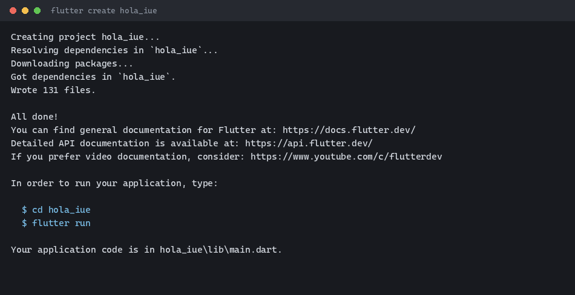{fig-alt="Terminal mostrando la salida completa de flutter create hola_iue, con la resolucion de dependencias y el mensaje Wrote 131 files"}
```{=html}
</figure>
```

Flutter resuelve las dependencias, escribe alrededor de 130 archivos y termina con las
instrucciones para entrar a la carpeta y correr la app. Esa salida es real, capturada al preparar
este material.

### Opciones útiles de `flutter create`

El comando por defecto sirve para empezar, pero acepta banderas que vas a necesitar en cuanto
trabajes en un proyecto real:

::: {.calendario}
| Bandera | Para qué sirve |
|---|---|
| `--org com.tuempresa` | Fija el identificador de organización (por defecto `com.example`), usado en el `applicationId` de Android y el bundle id de iOS |
| `--platforms android,web` | Genera solo las carpetas nativas que necesitas, en vez de las seis por defecto |
| `-e`, `--empty` | Crea `main.dart` mínimo, sin el contador de ejemplo ni comentarios |
| `-a`, `--android-language` | `kotlin` (por defecto) o `java` para el código nativo de Android |
:::

Prueba la combinación con un proyecto de descarte, para ver el efecto real:

```bash
flutter create --org com.iue.demo --platforms android,web --empty demo_flags
```

```text
Creating project demo_flags...
Resolving dependencies in `demo_flags`...
Downloading packages...
Got dependencies in `demo_flags`.
Wrote 41 files.

All done!
In order to run your empty application, type:

  $ cd demo_flags
  $ flutter run

Your empty application code is in demo_flags\lib\main.dart.
```

Compara: `hola_iue` (todas las plataformas, plantilla completa) escribió unos 130 archivos.
`demo_flags` (solo `android` y `web`, plantilla vacía) escribió 41. Su `main.dart` queda así de
corto:

```dart
import 'package:flutter/material.dart';

void main() {
  runApp(const MainApp());
}

class MainApp extends StatelessWidget {
  const MainApp({super.key});

  @override
  Widget build(BuildContext context) {
    return const MaterialApp(
      home: Scaffold(
        body: Center(
          child: Text('Hello World!'),
        ),
      ),
    );
  }
}
```

Salida y código reales, generados en esta máquina con Flutter 3.41.9. Una nota de precisión: la
guía de referencia de un semestre anterior menciona también `--ios-language`; en esta versión de
Flutter esa bandera existe pero está marcada como obsoleta (`flutter create -h -v` lo confirma):
Swift es siempre el lenguaje de iOS ahora, la bandera no hace nada.

### Abre el proyecto en tu editor

```bash
cd hola_iue
code .
```

Con las extensiones **Flutter** y **Dart** instaladas en VS Code (las instalaste en el Tema 1)
obtienes autocompletado, navegación del árbol de widgets, depuración integrada y un botón de
recarga en caliente en la barra de estado. Si prefieres Android Studio, usa `Open` desde la
pantalla de inicio y selecciona la carpeta del proyecto: lo reconoce automáticamente como proyecto
Flutter.

### Anatomía de la carpeta generada

::: {.diagrama}
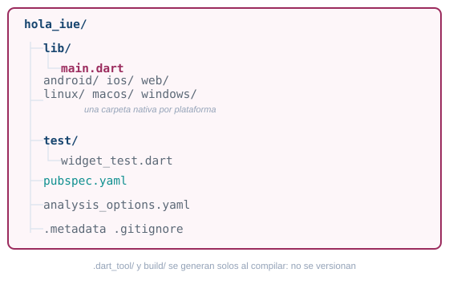{fig-alt="Estructura de carpetas que genera flutter create: lib con main.dart, una carpeta por plataforma nativa, test, y los archivos pubspec.yaml, analysis_options.yaml, metadata y gitignore. dart_tool y build se generan solos y no se versionan"}
:::

::: {.calendario}
| Archivo o carpeta | Para qué sirve | Cuándo la tocas |
|---|---|---|
| `lib/main.dart` | El punto de entrada de la app | Siempre: aquí vive casi todo tu código |
| `android/` | Proyecto nativo de Android (Gradle); Flutter inyecta ahí el código Dart compilado | Para permisos, el ícono de la app o el `applicationId` |
| `ios/` | Proyecto nativo de iOS (Xcode); solo se compila desde macOS | Para permisos o el bundle id |
| `web/`, `linux/`, `macos/`, `windows/` | Proyectos nativos del resto de plataformas | Rara vez; sobre todo íconos y metadatos |
| `test/widget_test.dart` | Una prueba de ejemplo sobre el widget inicial | Cuando escribes pruebas |
| `pubspec.yaml` | Nombre, versión, dependencias y assets del proyecto | Cada vez que agregas un paquete o un asset |
| `analysis_options.yaml` | Reglas del analizador, con `flutter_lints` activado por defecto | Si quieres activar o apagar una regla del linter |
| `.metadata` | Registro interno de Flutter: versión del SDK y plantilla usadas al crear el proyecto | Nunca, es generado |
| `.gitignore` | Ignora `.dart_tool/`, `build/` y archivos generados por cada IDE | Rara vez |
:::

`.dart_tool/` y `build/` aparecen la primera vez que corres o compilas la app. No los toques ni los
subas a git: se regeneran solos con `flutter pub get` y `flutter run`. Y ni se te ocurra editar
`GeneratedPluginRegistrant` dentro de `android/` o `ios/`: como el nombre lo dice, Flutter lo
regenera solo en cada build.

### El código que generó `flutter create`

Abre `hola_iue/lib/main.dart`. Es el punto de entrada de toda la app: cuando corres `flutter run`,
Dart llama primero a la función `main()` de este archivo.

```dart
import 'package:flutter/material.dart';

void main() {
  runApp(const MyApp());
}

class MyApp extends StatelessWidget {
  const MyApp({super.key});

  @override
  Widget build(BuildContext context) {
    return MaterialApp(
      title: 'Flutter Demo',
      theme: ThemeData(
        colorScheme: .fromSeed(seedColor: Colors.deepPurple),
      ),
      home: const MyHomePage(title: 'Flutter Demo Home Page'),
    );
  }
}
```

- `import 'package:flutter/material.dart'` trae la biblioteca de Material Design, con casi todos
  los widgets que usa este curso.
- `void main()` es la función de entrada del programa Dart, igual que en la Parte 1; en un proyecto
  Flutter, lo único que hace es arrancar la app.
- `runApp(const MyApp())` toma un widget y lo convierte en la raíz del árbol de widgets: ese widget
  ocupa toda la pantalla.
- `class MyApp extends StatelessWidget` declara un widget sin estado propio: su apariencia depende
  solo de lo que devuelve `build()`, nunca cambia por sí sola.
- `MaterialApp` es el widget que configura toda la app de una vez: tema, título, pantalla inicial y
  rutas de navegación.

`MaterialApp` tiene una alternativa, `CupertinoApp`, para cuando quieres que la app se vea como una
app nativa de iOS en vez de Material Design:

::: {.calendario}
| `MaterialApp` | `CupertinoApp` |
|---|---|
| Estilo Material Design (Google), el que usa Android | Estilo iOS (Apple) |
| Widgets: `Scaffold`, `AppBar`, `ElevatedButton` | Widgets: `CupertinoPageScaffold`, `CupertinoButton` |
| Funciona igual de bien en iOS que en Android | Pensado para apps que imitan el look nativo de iOS |
| El que usa este curso | Para apps que imitan a fondo el estilo iOS |
:::

Otras propiedades de `MaterialApp` que vas a usar seguido:

```dart
MaterialApp(
  title: 'Nombre de la app',          // usado por el sistema operativo, no se ve en pantalla
  debugShowCheckedModeBanner: false,  // oculta la cinta roja "DEBUG" de la esquina
  theme: ThemeData(...),              // tema claro
  darkTheme: ThemeData(...),          // tema oscuro
  home: const MyHomePage(...),        // la primera pantalla que se muestra
)
```

### `pubspec.yaml`, explicado

```yaml
name: hola_iue
description: "A new Flutter project."
publish_to: 'none'
version: 1.0.0+1

environment:
  sdk: ^3.11.5

dependencies:
  flutter:
    sdk: flutter
  cupertino_icons: ^1.0.8

dev_dependencies:
  flutter_test:
    sdk: flutter
  flutter_lints: ^6.0.0

flutter:
  uses-material-design: true
```

`name` es el identificador interno del paquete: solo minúsculas y guiones bajos, sin espacios.
`environment: sdk:` fija qué versiones de Dart acepta el proyecto; el símbolo `^` significa
"esta versión o cualquier compatible más nueva, sin cambios que rompan el código". `dependencies`
son los paquetes que tu app necesita para funcionar; `dev_dependencies` son los que solo hacen
falta mientras desarrollas (pruebas, reglas de estilo). `flutter: uses-material-design: true`
habilita el paquete completo de íconos de Material Design.

El campo `version: 1.0.0+1` tiene dos partes separadas por `+`. Antes del `+` va el nombre de
versión que ve el usuario (sigue [semver](https://semver.org/): MAYOR.MENOR.PARCHE). Después del
`+` va el código de versión interno: un entero que debes subir en cada release, porque Android e
iOS lo usan para saber si una versión es más nueva que la anterior instalada.

**Cómo agregar un paquete a un proyecto Flutter** (el equivalente a `dart pub add` que ya usaste
en la Parte 1, pero para proyectos Flutter):

```bash
flutter pub add shared_preferences
```

Ese comando agrega la línea a `dependencies` en `pubspec.yaml` y descarga el paquete. Luego lo
importas donde lo necesites:

```dart
import 'package:shared_preferences/shared_preferences.dart';
```

### [4]{.paso} Ejecuta la app

Confirma qué dispositivos ve Flutter. En esta máquina, sin ningún emulador Android abierto
todavía, `flutter devices` responde esto (salida real):

```text
Found 3 connected devices:
  Windows (desktop) - windows - windows-x64
  Chrome (web)       - chrome  - web-javascript
  Edge (web)         - edge    - web-javascript
```

Con el emulador Android que dejaste listo en el Tema 1 abierto, aparece una cuarta línea con su
nombre. Corre la app en el dispositivo por defecto:

```bash
cd hola_iue
flutter run
```

O elige un dispositivo específico con `-d` (útil cuando tienes varios abiertos a la vez):

```bash
flutter run -d chrome
flutter run -d windows
```

```{=html}
<figure>
```
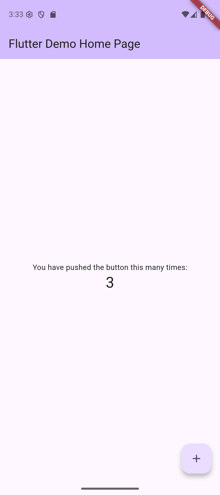{fig-alt="Emulador Android ejecutando la app de plantilla Flutter Demo Home Page, con el contador en 3, fondo lila y boton flotante de mas"}
```{=html}
</figure>
```

Esa es la app de plantilla: un contador que sube cada vez que tocas el botón flotante. La captura
es real, tomada en el emulador durante la preparación de este material.

### Recarga en caliente frente a reinicio en caliente

Con `flutter run` corriendo, la terminal queda escuchando teclas. Cambia algo en `lib/main.dart`
(por ejemplo el texto `'Flutter Demo Home Page'`), guarda el archivo, y presiona `r` en la
terminal.

::: {.diagrama}
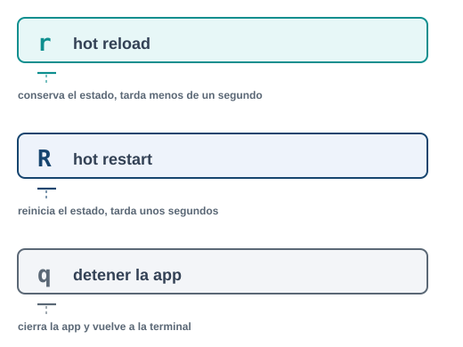{fig-alt="Comparacion entre hot reload con la tecla r, que inyecta el codigo nuevo y conserva el estado, hot restart con la tecla R mayuscula, que reinicia el estado, y la tecla q para detener la app"}
:::

La recarga en caliente (`r`) inyecta el código nuevo en la app que ya está corriendo y conserva el
estado: si el contador iba en 3, sigue en 3. El reinicio en caliente (`R` mayúscula) reconstruye la
app desde cero y el estado vuelve a su valor inicial. Usa `R` cuando cambiaste `main()`, una
variable global, o cuando la recarga en caliente no parece reflejar tu cambio.

Mientras `flutter run` sigue corriendo, la terminal escucha varias teclas más:

::: {.calendario}
| Tecla | Acción |
|---|---|
| `r` | Recarga en caliente: conserva el estado |
| `R` | Reinicio en caliente: pierde el estado |
| `p` | Muestra los bordes de cada widget, util para depurar el layout |
| `h` | Lista todos los atajos disponibles |
| `d` | Desconecta la terminal sin cerrar la app |
| `q` | Cierra la app y vuelve a la terminal |
:::

### Comandos de Flutter que vas a usar todo el semestre

::: {.calendario}
| Comando | Para qué sirve |
|---|---|
| `flutter doctor` | Diagnostica el entorno: SDK, Android Studio, dispositivos, licencias |
| `flutter devices` | Lista los emuladores y dispositivos físicos disponibles |
| `flutter create nombre` | Crea un proyecto nuevo con la plantilla estandar |
| `flutter run` | Compila y ejecuta la app en el dispositivo seleccionado |
| `flutter pub get` | Descarga las dependencias del `pubspec.yaml` |
| `flutter analyze` | Busca errores y avisos de estilo sin ejecutar la app |
| `flutter test` | Corre las pruebas del proyecto |
| `flutter clean` | Borra `build/` y `.dart_tool/`; usalo cuando un error no tiene sentido |
:::

## Errores frecuentes

::: {.error-caso}
[Error 1]{.etiqueta}

### Fallo de Gradle al compilar para Android

**Causa.** Al compilar por primera vez, Gradle descarga el plugin de Flutter desde
`plugins.gradle.org`. Si la red no puede resolver ese host (proxy, firewall institucional, o una
caída puntual de DNS), la compilación falla con un mensaje como este, capturado real durante la
preparación del material:

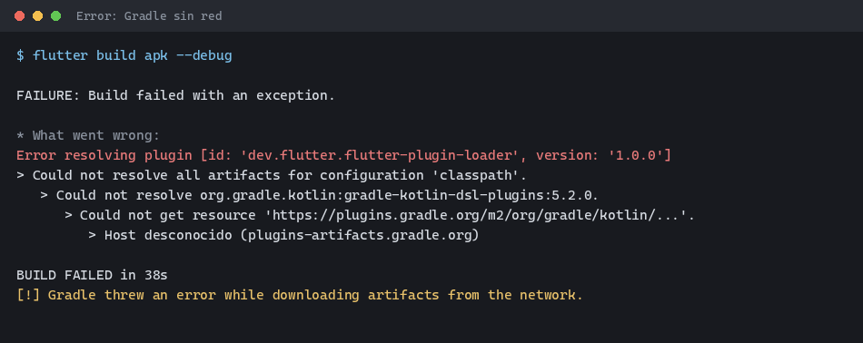{fig-alt="Terminal mostrando un fallo de Gradle: no pudo resolver el plugin dev.flutter.flutter-plugin-loader porque el host plugins-artifacts.gradle.org no respondio"}

**Solución.** Confirma que tienes salida a internet fuera de la red de la institución si sospechas
un bloqueo, o cambia de red. Vuelve a intentar el build: casi siempre es una falla puntual de
resolución de DNS, no un problema del proyecto. Si se repite siempre en la misma red, revisa con
el área de sistemas si `plugins.gradle.org` está bloqueado.
:::

::: {.error-caso}
[Error 2]{.etiqueta}

### `flutter run` no encuentra dispositivos

**Causa.** El emulador no está abierto, o el dispositivo físico no tiene la depuración USB
activada (la revisaste en el Tema 1).

**Solución.** Abre el emulador desde Android Studio antes de correr `flutter run`, o corre
`flutter devices` para confirmar que tu dispositivo aparece en la lista antes de intentar de
nuevo.
:::

::: {.error-caso}
[Error 3]{.etiqueta}

### La recarga en caliente no refleja el cambio

**Causa.** Cambiaste `main()`, una variable `const` de nivel superior, o el estado inicial de un
`State`. La recarga en caliente solo aplica cambios dentro de métodos existentes.

**Solución.** Usa reinicio en caliente (`R`) en vez de recarga (`r`).
:::

## Parte 3. Una pantalla con estado propio

El pacto de este tema pide que Dart y la asincronía queden dominados, y que tu app reaccione a
la interacción del usuario. Aquí llega justo lo mínimo para que una pantalla tenga memoria propia,
sin el árbol de widgets completo ni el ciclo de vida de un `State`.

### `StatelessWidget` frente a `StatefulWidget`

Un `StatelessWidget` no guarda nada: una vez construido, se ve siempre igual mientras no cambien
sus parámetros de entrada. Un `StatefulWidget` sí guarda datos propios, en un objeto `State`
aparte, y puede reconstruirse a sí mismo cuando esos datos cambian.

::: {.diagrama}
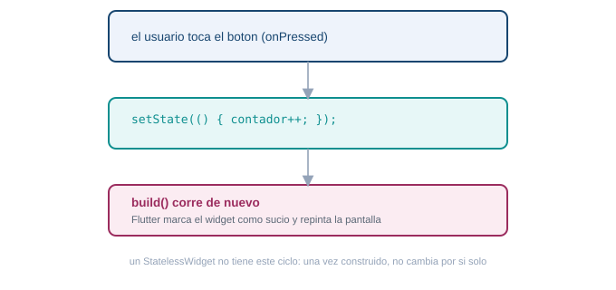{fig-alt="Ciclo minimo de un StatefulWidget: el usuario toca un boton, el codigo llama a setState, Flutter vuelve a ejecutar build y la pantalla se repinta con el nuevo valor"}
:::

::: {.acceso}
Complemento: arquitectura de Flutter

[Como se estructura un programa Flutter](arquitectura-flutter.qmd){.btn-doc}
:::

En `hola_iue/lib/main.dart`, `MyApp` es un `StatelessWidget` (nunca cambia) y `MyHomePage` es un
`StatefulWidget` cuyo estado vive en `_MyHomePageState`:

```dart
class _MyHomePageState extends State<MyHomePage> {
  int _counter = 0;

  void _incrementCounter() {
    setState(() {
      _counter++;
    });
  }
  // ...
}
```

`setState` hace dos cosas: cambia el valor, y le avisa a Flutter que este widget necesita volver a
dibujarse. Si quitas el `setState` y dejas solo `_counter++;`, el número cambia en memoria pero la
pantalla nunca se entera.

Una nota sobre el propio `main.dart` generado: vas a ver líneas como
`colorScheme: .fromSeed(seedColor: Colors.deepPurple)` o `mainAxisAlignment: .center`, sin el
nombre completo `ColorScheme.fromSeed` o `MainAxisAlignment.center` delante del punto. Es una
forma abreviada de Dart moderno: cuando el tipo esperado ya se conoce por el contexto (aquí,
Flutter sabe que `colorScheme` espera un `ColorScheme`), puedes escribir solo `.loQueSea` y Dart
completa el resto. No necesitas dominarla hoy, solo reconocerla cuando la veas.

### [5]{.paso} Dale un estado propio a la pantalla

La plantilla ya reacciona a la interacción (el contador sube al tocar el botón), pero es genérica.
Tu entregable pide una pantalla con estado **propio**.

::: {.callout-tip}
## Reto 5. Un estado que sea tuyo

Cambia `_MyHomePageState` para que guarde algo distinto al contador de ejemplo. Necesitas: una
variable de estado propia (no `_counter`), una condición que decida qué se muestra según esa
variable, y un `setState` disparado por un botón o un gesto que la cambie. Antes de mirar la
solución, intenta escribir tu propia versión: puede ser un corazón de favorito, un interruptor de
tema claro/oscuro, o cualquier otra idea tuya.
:::

::: {.callout-note collapse="true"}
## Solución del Reto 5 (un ejemplo, no la única respuesta)

```dart
class _MyHomePageState extends State<MyHomePage> {
  bool _favorito = false;

  void _alternarFavorito() {
    setState(() {
      _favorito = !_favorito;
    });
  }

  @override
  Widget build(BuildContext context) {
    return Scaffold(
      appBar: AppBar(title: Text(widget.title)),
      body: Center(
        child: Column(
          mainAxisAlignment: MainAxisAlignment.center,
          children: [
            Icon(
              _favorito ? Icons.favorite : Icons.favorite_border,
              color: _favorito ? Colors.red : Colors.grey,
              size: 64,
            ),
            Text(_favorito ? "En tus favoritos" : "Toca para agregar"),
          ],
        ),
      ),
      floatingActionButton: FloatingActionButton(
        onPressed: _alternarFavorito,
        child: const Icon(Icons.favorite),
      ),
    );
  }
}
```

No copies este ejemplo tal cual para tu entregable: usa una variable, una condición y una
interacción distintas (un contador con límite, un interruptor de tema, una lista que crece al
tocar un botón). La idea es que el `setState` sea tuyo, no una copia.
:::

## Lista de chequeo del tema

::: {.checklist}
- [ ] Creaste un proyecto Dart con `dart create -t console` y corriste `dart run` sobre él.
- [ ] Practicaste variables, tipos, null safety, funciones y clases en `bin/hola_dart.dart`.
- [ ] Escribiste y corriste una función `async` con `await` y manejo de errores.
- [ ] Resolviste los cinco retos de la guía antes de mirar la solución.
- [ ] Creaste `hola_iue` con `flutter create` y explicas para qué sirve cada carpeta que genera.
- [ ] Ejecutaste la app en el emulador y probaste la recarga y el reinicio en caliente.
- [ ] Tu app tiene una pantalla con estado propio, distinta al contador de la plantilla.
:::

## Recursos

- Tour del lenguaje Dart: <https://dart.dev/language>
- Biblioteca de paquetes Dart y Flutter: <https://pub.dev>
- Documentación oficial de Flutter: <https://docs.flutter.dev>
- Codelab oficial "Write your first Flutter app": <https://docs.flutter.dev/get-started/codelab>

Si quieres entender cómo está construido Flutter por dentro antes de seguir escribiendo pantallas,
continúa con [Arquitectura de Flutter, cómo se estructura un programa multiplataforma](arquitectura-flutter.qmd).

::: {.pie-doc}
Lenguajes de computación para móviles. Fundación Universitaria María Cano. Facultad de Ingeniería.
Semestre 2026-02.

**Transparencia.** La redacción de esta guía contó con el apoyo de inteligencia artificial,
usando el modelo Claude Sonnet 5 de Anthropic. Todo el contenido fue revisado y validado. Las
capturas de terminal y de emulador son reales, tomadas durante la preparación del material.
:::
